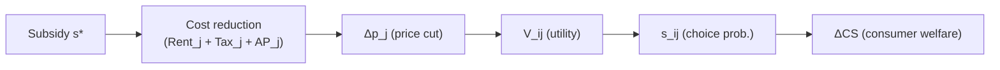
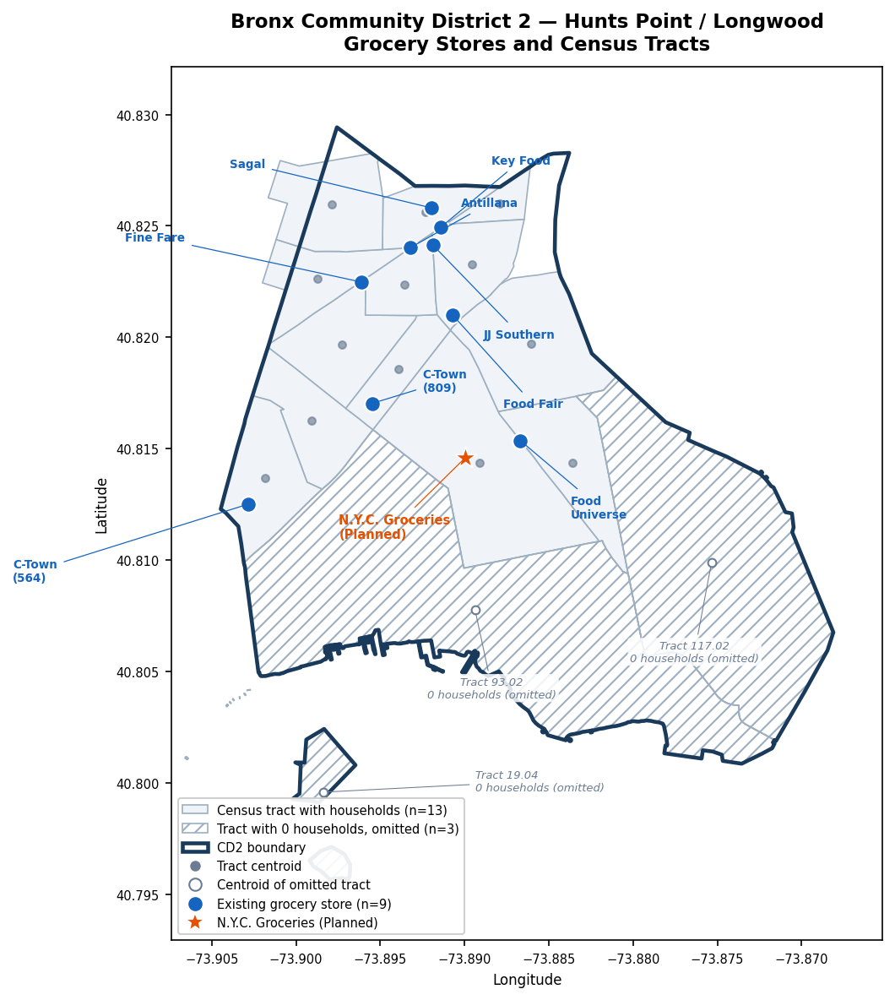

# NYC Grocery Subsidy Model Specification — v2

**Study area:** Bronx Community District 2 (Hunts Point / Longwood), New York City  
**Policy context:** NYCEDC Request for Proposals — *NYC Groceries* initiative. The RFP solicits a city-operated or city-partnered full-service grocery store offering a 30% discount on a defined core basket of staple items, with NYCEDC covering rent, property taxes, and any remaining Affordability Payment required to deliver the discount.  
**Model vintage:** September 2026 · data vintage: 2024 ACS / Aug 2026 CPI-adjusted prices / FY2025 DOF tax and rent · **v2, 2026-09-30**

---

## Changes from v1

v1: [`MAIN_NYC_Grocery_Subsidy_Model_Specification.md`](MAIN_NYC_Grocery_Subsidy_Model_Specification.md) (unchanged).

1. **Distance $d_{tj}$ is Manhattan distance in miles** (§1.1.1). v1 described it as straight-line. The data file is the same (`data/distance/d_tract_store_miles.csv`, built by `code/build_d_ij.py`), and it was already Manhattan. Only the label changed, and the formula is now written out.
2. **Utility now shows the Gumbel error term** (§1.1.1): $U_{ij} = V_{ij} + \varepsilon_{ij}$. It is notation only; $\varepsilon_{ij}$ is **not modeled**. §1.1.3 and §1.1.5 note how $s_{ij}$ and $W_i$ follow from it.
3. **Consumer groups corrected to 13 tracts × 3 = 39** (§1.1.2). Three of the 16 CD2 tracts have 0 households in ACS 2024 (19.04, 93.02, 117.02). v1 said 15 tracts / 45 groups.
4. **Revenue $R_j$ uses the v2 Census estimate**, the pooled rate of \$801/sq ft/yr (range \$698–\$845), following [`docs/revenue_census_estimate_v2.md`](docs/revenue_census_estimate_v2.md) (§1.2.1, Part 2).
5. **Rent and Tax use the FY2025 v2 values**, following [`docs/rent_and_tax_fy2025_v2.md`](docs/rent_and_tax_fy2025_v2.md) (§1.2.1, §1.3.2, Part 2).
6. **N.Y.C. Groceries inputs updated** (Part 2):
   - $R_j$ now uses the v2 rate.
   - $\text{Tax}_j$ is re-derived from the v2 tax file.
   - The coordinates are the PLUTO point already used for distances.
   - The post-discount basket prices are recomputed; v1's figures were about \$1 too low.
7. **New map** (Part 3): the 3 zero-household tracts are left unshaded and labelled as omitted.
8. **New companion report:** [`docs/cd2_descriptive_statistics_v2.md`](docs/cd2_descriptive_statistics_v2.md) (income-group balance, $\bar f_g$, $\kappa$, CD2 and store statistics).

Files marked **(new in v2)** were created for this version. Every other file already existed.

---

## Causal Chain

---

## Part 1 — Model Equations

### 1.1 Consumer Demand

#### 1.1.1 Utility

$$U_{ij} = V_{ij} + \varepsilon_{ij}, \qquad \varepsilon_{ij} \overset{\text{i.i.d.}}{\sim} \text{Gumbel}(0, 1)$$

$$V_{ij} = \beta_{\text{sqft}} \cdot \text{sqft}_j \;-\; \beta_{p,i} \cdot p_j \;-\; \beta_{d,i} \cdot d_{tj}$$

$$d_{tj} = 69.17\,\big|\text{lat}_t - \text{lat}_j\big| \;+\; 69.17\cos\!\big(\overline{\text{lat}}_{tj}\big)\,\big|\text{lon}_t - \text{lon}_j\big| \quad \text{(miles)}$$

| Symbol | Type | Description | Value / Source |
|--------|------|-------------|----------------|
| $U_{ij}$ | latent | Total (random) utility for consumer group $i$ choosing store $j$ | not computed; see note below |
| $V_{ij}$ | output | Systematic (representative) utility, the part the model computes | derived |
| $\varepsilon_{ij}$ | latent | Idiosyncratic taste shock, i.i.d. Type I extreme value (Gumbel), location 0, scale 1 | **notation only; not modeled** |
| $\beta_{\text{sqft}}$ | param | Marginal utility of store floor area; common across groups | **design decision — no dataset** |
| $\text{sqft}_j$ | data | Store floor area (sq ft, Ag & Markets license) | `data/stores/large_grocery_stores_cd2.csv` |
| $\beta_{p,i}$ | param | Price dis-utility per dollar; varies by income group $g$ | **design decision — no dataset** |
| $p_j$ | data | 10-item Crossa basket price, CPI-adjusted to Aug 2026 ($/basket) | `data/prices/p_j_cd2_candidate_stores.csv` |
| $\beta_{d,i}$ | param | Distance dis-utility per mile; varies by income group $g$ | **design decision — no dataset** |
| $d_{tj}$ | data | **Manhattan distance (miles)** from tract $t$ centroid to store $j$: north-south gap plus east-west gap, the way you walk around city blocks. $\overline{\text{lat}}_{tj}$ is the mean latitude of the pair; 1° longitude ≈ 52.4 mi in the Bronx | `data/distance/d_tract_store_miles.csv` (16 tracts × 10 stores, column `miles`), built by `code/build_d_ij.py` |

> **Why the error term is written out, and why it is not modeled.**
>
> **What it is.** $\varepsilon_{ij}$ stands for everything about household $i$'s preference for store $j$ that the model does not observe: habit, a friend who works there, a favourite brand, a route to work. It is assumed i.i.d. across groups and stores and distributed Gumbel (Type I extreme value) with location 0 and scale 1. Its mean is $\gamma \approx 0.5772$ (Euler's constant) and its variance is $\pi^2/6$.
>
> **Why it matters for the rest of the formulation.** Every downstream formula follows from this assumption:
> - **Choice probability (§1.1.3).** Integrating $\varepsilon_{ij}$ out of $\Pr(U_{ij} \ge U_{ik}\ \forall k)$ gives the closed-form logit $s_{ij} = e^{V_{ij}} / \sum_k e^{V_{ik}}$ (McFadden 1974). No other common error distribution gives a closed form.
> - **Welfare (§1.1.5).** The expected maximum utility is $E[\max_k U_{ik}] = \ln \sum_k e^{V_{ik}} + \gamma$. That is why consumer welfare is a *logsum* (Small and Rosen 1981). The constant $\gamma$ cancels in $\Delta CS$ (post minus pre).
> - **Scale of the betas.** Utility has no natural units, so the Gumbel scale is normalized to 1. Every $\beta$ is measured relative to the spread of $\varepsilon_{ij}$. Coefficients calibrated from published logit studies carry the same normalization, which is what makes them transferable. Dividing by $\beta_{p,i}$ converts utils to dollars.
> - **Substitution pattern.** The i.i.d. assumption implies independence of irrelevant alternatives (IIA). When N.Y.C. Groceries enters, it draws share from every existing store in proportion to that store's current share within each group $i$.
>
> **What is not done.** $\varepsilon_{ij}$ is **not modeled**:
> - it is not estimated, and its scale is not calibrated;
> - it is not simulated, and no random draws are taken;
> - individual choices are not generated.
>
> The model computes only $V_{ij}$ and uses the closed forms for $s_{ij}$ and the logsum, in which $\varepsilon_{ij}$ has already been integrated out. $U_{ij}$ appears here so the specification states the assumption that justifies those formulas. Sources: McFadden (1974) and Small and Rosen (1981) in `docs/research_papers/` (*Conditional Logit Analysis of Qualitative Choice Behavior.pdf*, *Applied Welfare Economics with Discrete Choice Models.pdf*); Train, *Discrete Choice Methods with Simulation*, Chapter 3 (`docs/research_papers/Discrete Choice Methods with Simulation Ch 1 to 3.pdf`).

---

#### 1.1.2 Consumer Groups

Index $i$ runs over **39 consumer groups: 13 census tracts $t$ with households × 3 income groups** $g \in \{\text{Low, Mid, High}\}$. Three CD2 tracts (19.04 North & South Brother Islands, 93.02 Hunts Point market area, 117.02 eastern industrial area) have 0 households in ACS 2024 and are omitted.

$$i \;\equiv\; (t,\, g), \qquad n_i \equiv n_{t,g}$$

$$\sum_i n_i = N_{\text{HH}} = 19{,}922$$

Distance $d_{tj}$ is identical for all three income groups within tract $t$; it varies only across tracts.

| Symbol | Description | Value (2024) | Source |
|--------|-------------|--------------|--------|
| $t$ | Census tract index | 13 active tracts (of 16) | `data/geography/bronx_cd2_tract_centroids.csv` |
| $g$ | Income group | Low ($<$\$25K), Mid (\$25–50K), High ($>$\$50K) | — |
| $n_{t,g}$ | Households in tract $t$, group $g$ | 129–1,277 per group (see companion report) | `data/acs/cd2_B19001_2024.csv`; tidy table `data/descriptive_stats_v2/hh_by_tract_income_group_v2.csv` **(new in v2)** |
| $N_{\text{HH}}$ | Total CD2 households | 19,922 (Low 7,683 · Mid 4,795 · High 7,444) | `data/acs/cd2_B19001_2024.csv` |

> The full $n_{t,g}$ table, and a check of whether the groups are balanced, are in [`docs/cd2_descriptive_statistics_v2.md`](docs/cd2_descriptive_statistics_v2.md). In short, the groups are unequal in size (Mid is about 24% of households, against 37–39% for Low and High), but they are spread fairly evenly across tracts (Cramér's V = 0.17).

---

#### 1.1.3 Choice Probability

$$s_{ij} = \Pr\!\big(U_{ij} \ge U_{ik}\ \ \forall k\big) = \frac{\exp(V_{ij})}{\displaystyle\sum_{k=1}^{J} \exp(V_{ik})}$$

The second equality follows from integrating out the i.i.d. Gumbel $\varepsilon_{ij}$ (§1.1.1). Only $V_{ij}$ is computed.

| Symbol | Description |
|--------|-------------|
| $s_{ij}$ | Probability that consumer group $i$ chooses store $j$ |
| $J$ | Number of stores in choice set (9 existing; 10 with planned NYC Groceries) |

---

#### 1.1.4 Aggregate Market Share

$$S_j = \frac{1}{N_{\text{HH}}} \sum_{i} n_i \cdot s_{ij}$$

| Symbol | Description |
|--------|-------------|
| $S_j$ | CD2-wide market share of store $j$ |

---

#### 1.1.5 Consumer Welfare (Annual Logsum)

$$E\!\left[\max_k U_{ik}\right] = \ln\!\left[\sum_{k=1}^{J} \exp(V_{ik})\right] + \gamma \qquad \text{(Gumbel result; } \gamma \approx 0.5772\text{)}$$

$$W_i = \frac{T}{\beta_{p,i}} \ln\!\left[\sum_{k=1}^{J} \exp(V_{ik})\right]$$

$$\Delta CS = \sum_{i} \frac{n_i \cdot T}{\beta_{p,i}} \left[\ln\sum_{k} \exp\!\left(V_{ik}^{\text{post}}\right) \;-\; \ln\sum_{k} \exp\!\left(V_{ik}^{\text{pre}}\right)\right]$$

$W_i$ is written without the constant $\gamma$ because it cancels in $\Delta CS$. The formula assumes utility is linear in price (no income effects), so $1/\beta_{p,i}$ converts utils to dollars.

| Symbol | Description | Value | Source |
|--------|-------------|-------|--------|
| $T$ | Shopping trips per year | 52 | **design decision** |
| $W_i$ | Annual consumer welfare for group $i$ (in utils, scaled by $1/\beta_{p,i}$) | derived | — |
| $\Delta CS$ | Annual change in consumer surplus across all 39 groups ($) | derived | — |

> **Issue #4 fix (from v1):** v3 welfare was per trip; multiplying by $T = 52$ converts to annual.

---

### 1.2 Store Price and Volume

#### 1.2.1 Revenue and Basket Volume

$$R_j = \text{sqft}_j \times r, \qquad r = \$801.18/\text{sq ft/yr (2024 \$)}$$

$$Q_j = \frac{R_j}{p_j}$$

$$M = \sum_{g} N_{g} \cdot \bar{f}_g \cdot 52 \;\approx\; \$112.98\text{M/yr (2024)}$$

| Symbol | Description | Value | Source |
|--------|-------------|-------|--------|
| $R_j$ | Annual revenue ($) | see store table below; 9-store total \$54.96M (49% of $M$) | `data/revenue_census_estimate/v2/revenue_j_census_v2_cd2_candidate_stores.csv` (column `revenue_census_v2`; low / high `revenue_census_v2_low` / `_high`) |
| $r$ | Bronx sales per sq ft: Census 2022 NAICS 445110 + 44513 sales (employer + nonemployer) ÷ sq ft of the matching Ag & Markets stores, CPI-adjusted to 2024 | **\$801.18** (range \$697.95–\$845.08) | `data/revenue_census_estimate/v2/bronx_sales_per_sqft_census_v2.csv` (variant `pooled_4451`; range = min / max of the pooled variants) |
| $Q_j$ | Annual basket-equivalent volume at store $j$ | 44,283–432,925 | same file, column `Q_j_census_v2` |
| $p_j$ | Basket price ($/basket) | \$27.76–\$30.32 | `data/prices/p_j_cd2_candidate_stores.csv` |
| $\bar{f}_g$ | Average weekly food-at-home expenditure, income group $g$ (NYC-scaled, Northeast CES) | Low \$81.64 · Mid \$94.17 · High \$146.94 | `data/bls/ces_fbar_by_income_group_northeast_cd2weighted.csv` |
| $N_g$ | Total households in income group $g$ (all tracts) | Low 7,683 · Mid 4,795 · High 7,444 | `data/acs/cd2_B19001_2024.csv` |
| $M$ | Annual CD2 grocery market size | \$112.98M | `data/bls/cd2_market_size_M_northeast_cd2weighted.csv` |

> **Revenue choice (v2):** v2 uses the pooled 4451 rate as the main $R_j$, with \$698–\$845 as the sensitivity range. ReferenceUSA 2024 (`data/revenue/revenue_j_cd2_candidate_stores.csv`, `revenue_rusa_2024`; 7 stores, \$23.8M) is kept only as an outside low case. See [`docs/revenue_census_estimate_v2.md`](docs/revenue_census_estimate_v2.md).

**Store-level data table (2024 revenue, FY2025 tax and rent, v2):**

| Store | Address | sqft (Ag & M) | Occupied sqft | $p_j$ | $R_j$ v2 (low – high) | $Q_j$ | $\text{Tax}_j$ v2 | $\text{Rent}_j$ v2 (low – high) |
|-------|---------|------|------|------|------------|------|--------|---------|
| Key Food | 1050 Westchester Ave | 15,000 | 12,810 | \$27.76 | \$12,018,000 (\$10.47M – \$12.68M) | 432,925 | \$89,902 | \$236,088 (\$221,869 – \$245,311) |
| Food Fair Fresh Market | 1065 E 163rd St | 13,000 | 11,400 | \$28.95 | \$10,415,000 (\$9.07M – \$10.99M) | 359,758 | \$58,408 (high \$359,038) | \$210,102 (\$197,448 – \$218,310) |
| Fine Fare Supermarket | 950 Westchester Ave | 10,000 | 10,000 | \$30.32 | \$8,012,000 (\$6.98M – \$8.45M) | 264,248 | \$8,140 | \$184,300 (\$173,200 – \$191,500) |
| C-Town Supermarket | 564 Southern Blvd | 8,000 | 10,000 | \$28.82 | \$6,409,000 (\$5.58M – \$6.76M) | 222,380 | \$30,864 | \$184,300 (\$173,200 – \$191,500) |
| Food Universe | 724 Hunts Pt Ave | 8,000 | 9,800 | \$29.93 | \$6,409,000 (\$5.58M – \$6.76M) | 214,133 | \$60,962 | \$187,670 (\$169,736 – \$187,670) |
| C Town Supermarket | 809 Southern Blvd | 7,500 | 9,200 | \$28.82 | \$6,009,000 (\$5.24M – \$6.34M) | 208,501 | \$57,991 | \$159,344 (\$159,344 – \$176,180) |
| JJ Southern Farm Fruit | 1046 Southern Blvd | 1,600 | 1,600 | \$28.95 | \$1,282,000 (\$1.12M – \$1.35M) | 44,283 | \$17,155 | \$69,008 (\$36,544 – \$69,008) |
| Antillana Fresh Meat Market | 1025 Westchester Ave | 3,000 | 4,635 | \$28.95 | \$2,404,000 (\$2.09M – \$2.54M) | 83,040 | \$18,597 | \$105,863 (\$105,863 – \$199,908) |
| Sagal Meat Market | 1091 Southern Blvd | 2,500 | 2,500 | \$28.95 | \$2,003,000 (\$1.75M – \$2.11M) | 69,188 | \$9,067 | \$66,800 (\$57,100 – \$107,825) |
| **Total (9 stores)** | | **68,600** | **71,945** | | **\$54,961,000** (\$47.88M – \$57.97M) | **1,898,456** | **\$351,085** (high \$651,715) | **\$1,403,475** (\$1.29M – \$1.59M) |

> - **Two square-footage columns.** "sqft (Ag & M)" is the licensed store size. It enters $V_{ij}$ ($\text{sqft}_j$) and revenue, because the revenue rate was built on it. "Occupied sqft" is the floor area the store actually occupies in its building, from the 2026-09-30 ZoLa and Google Earth site check. It is used only for rent and for the store's share of the lot's tax.
> - **Food Fair tax.** Its $\text{Tax}_j$ splits the lot's tax by each tenant's share of the lot's DOF-estimated income, because the lot has 17 storefronts. This is a modeling choice, not a DOF rule. The floor-area split (\$359,038, `Tax_j_high`) is the sensitivity case.
> - **Sources:**
>   - Revenue and $Q_j$: `data/revenue_census_estimate/v2/revenue_j_census_v2_cd2_candidate_stores.csv`
>   - Tax: `data/tax/v2/tax_j_cd2_candidate_stores_v2.csv` (`Tax_j`, `Tax_j_high`)
>   - Rent: `data/rent/v2/rent_j_cd2_candidate_stores_v2.csv` (`Rent_j`, `Rent_j_low`, `Rent_j_high`, `occupied_sqft`)
>   - One combined table: `data/descriptive_stats_v2/store_summary_stats_v2.csv` **(new in v2)**

---

### 1.3 Subsidy Pass-Through — Two Model Versions

#### 1.3.1 — v1: Lump-sum Subsidy, Variable Pass-Through

$$\Delta p_j = \theta \cdot \frac{s}{Q_j}$$

$$V_{ij}^{\text{post}} = V_{ij}^{\text{pre}} + \beta_{p,i} \cdot \Delta p_j$$

| Symbol | Description | Values |
|--------|-------------|--------|
| $s$ | Annual lump-sum subsidy instrument ($) | e.g. $s = \tau \cdot \text{Tax}_j$ (tax break) or $s = \sigma$ (direct rent subsidy) |
| $\theta$ | Pass-through rate: fraction of instrument that reduces shelf price | \{0.40, 0.65, 0.85\} — three sensitivity runs |
| $Q_j$ | Annual basket volume at store $j$ | from §1.2.1 (v2 revenue) |
| $\Delta p_j$ | Reduction in basket price | derived |

---

#### 1.3.2 — v2: NYC Groceries Contract (30% Core Basket Discount)

Core basket share $\kappa_g$ is applied per income group (base version; see sensitivity below).

**Price reduction entering the utility function:**

$$\Delta p_{j,g} = 0.30 \cdot \kappa_g \cdot p_j$$

$$V_{ij}^{\text{post}} = V_{ij}^{\text{pre}} + \beta_{p,i} \cdot 0.30 \cdot \kappa_g \cdot p_j$$

Each income group $g$ in tract $t$ experiences a different effective price cut because $\kappa_g$ varies by income.

**Revenue cost of the 30% discount:**

The store-level demand-weighted core basket share is:

$$\kappa_j = \frac{\displaystyle\sum_{i} s_{ij} \cdot n_i \cdot \kappa_g}{\displaystyle\sum_{i} s_{ij} \cdot n_i}$$

$$\text{Gross discount cost} = 0.30 \cdot \kappa_j \cdot R_j$$

**Affordability Payment and total subsidy cost:**

NYCEDC covers $\text{Rent}_j$ and $\text{Tax}_j$ directly (store does not pay these). If the gross discount cost exceeds rent plus tax relief, NYCEDC pays an additional Affordability Payment:

$$\text{AP}_j = \max\!\left(0,\; 0.30 \cdot \kappa_j \cdot R_j \;-\; \text{Rent}_j \;-\; \text{Tax}_j\right)$$

Total annual subsidy cost to NYCEDC:

$$s_j^* = \text{Rent}_j + \text{Tax}_j + \text{AP}_j = \max\!\left(\text{Rent}_j + \text{Tax}_j,\; 0.30 \cdot \kappa_j \cdot R_j\right)$$

| Symbol | Description | Value | Source |
|--------|-------------|-------|--------|
| $\kappa_g$ | Core basket share by income group | Low 0.6247 · Mid 0.6218 · High 0.6059 (base, 2024) | `data/bls/kappa_core_basket_share_northeast_cd2weighted.csv` |
| $\kappa_j$ | Demand-weighted store-level core basket share | derived from $s_{ij}$ | — |
| $\text{AP}_j$ | Affordability Payment: subsidy over and above rent+tax coverage ($) | derived | — |
| $s_j^*$ | Total annual NYCEDC cost per store ($) | derived | — |
| $\text{Rent}_j$ | Annual rent, FY2025 v2 (occupied sq ft × rent/sq ft) | \$66,800–\$236,088 (central); total \$1,403,475 | `data/rent/v2/rent_j_cd2_candidate_stores_v2.csv` (`Rent_j`; sensitivity `Rent_j_low` / `Rent_j_high`) |
| $\text{Tax}_j$ | Annual property tax, store share, FY2025 v2 | \$8,140–\$89,902; total \$351,085 (high \$651,715) | `data/tax/v2/tax_j_cd2_candidate_stores_v2.csv` (`Tax_j`; sensitivity `Tax_j_high`) |

> **Scale check (illustrative, not a model output).** At the CD2-overall $\kappa_{\text{base}} = 0.6146$, the gross discount cost is $0.30 \times 0.6146 \times R_j \approx 18\%$ of revenue. Rent + Tax v2 is 2.4–6.7% of $R_j$ at every store. So $\text{AP}_j > 0$ for all 9 stores, and $s_j^*$ will be set by the discount cost, not by rent and tax.

**$\kappa$ sensitivity (base run primary; low/high as bounds):**

| Income group | $\kappa_{\text{low}}$ | $\kappa_{\text{base}}$ | $\kappa_{\text{high}}$ |
|---|---|---|---|
| Low ($<$\$25K) | 0.4026 | 0.6247 | 0.8468 |
| Mid (\$25–50K) | 0.3957 | 0.6218 | 0.8480 |
| High ($>$\$50K) | 0.3681 | 0.6059 | 0.8437 |
| CD2 overall | 0.3838 | 0.6146 | 0.8455 |

The $\kappa$ version controls which grocery sub-categories count as "core basket":  
- **low**: only unambiguous staples (meat, dairy, produce, grains — RFP-clear items)  
- **base**: "partly in" categories (frozen foods, snacks, condiments) weighted 0.5  
- **high**: all "partly in" items at full weight

Sensitivity output table (populated when model runs):

| Store | $\text{AP}_j$ ($\kappa_{\text{low}}$) | $\text{AP}_j$ ($\kappa_{\text{base}}$) | $\text{AP}_j$ ($\kappa_{\text{high}}$) | $\Delta CS$ ($\kappa_{\text{low}}$) | $\Delta CS$ ($\kappa_{\text{base}}$) | $\Delta CS$ ($\kappa_{\text{high}}$) |
|-------|---|---|---|---|---|---|
| Key Food | — | — | — | — | — | — |
| Food Fair Fresh Market | — | — | — | — | — | — |
| Fine Fare Supermarket | — | — | — | — | — | — |
| C-Town (564) | — | — | — | — | — | — |
| Food Universe | — | — | — | — | — | — |
| C-Town (809) | — | — | — | — | — | — |
| JJ Southern Farm | — | — | — | — | — | — |
| Antillana | — | — | — | — | — | — |
| Sagal | — | — | — | — | — | — |

---

### 1.4 Welfare Update Steps

Applies identically to v1 and v2 of the pass-through. All steps use $V_{ij}$ only; $\varepsilon_{ij}$ has been integrated out analytically (§1.1.1).

**Step A — Pre-subsidy utility (baseline):**

$$V_{ij}^{\text{pre}} = \beta_{\text{sqft}} \cdot \text{sqft}_j - \beta_{p,i} \cdot p_j - \beta_{d,i} \cdot d_{tj}$$

**Step B — Post-subsidy utility:**

$$V_{ij}^{\text{post}} = V_{ij}^{\text{pre}} + \beta_{p,i} \cdot \Delta p_{j,g}$$

where $\Delta p_{j,g}$ is from §1.3.1 (v1) or §1.3.2 (v2).

**Step C — Logsum welfare by group:**

$$L_i^{\text{pre}} = \ln\!\sum_{k=1}^{J}\exp\!\left(V_{ik}^{\text{pre}}\right), \qquad L_i^{\text{post}} = \ln\!\sum_{k=1}^{J}\exp\!\left(V_{ik}^{\text{post}}\right)$$

**Step D — Annual consumer surplus change:**

$$\Delta CS = \sum_{i=1}^{39} \frac{n_i \cdot T}{\beta_{p,i}} \left(L_i^{\text{post}} - L_i^{\text{pre}}\right)$$

---

### 1.5 Optimization and Store Ranking

**Store selection (9 existing stores):**

For v1, find $s_j^*$ such that $\Delta CS(s_j^*) \geq \Delta CS_{\min}$ via grid search over $s$. For v2, $\Delta p_{j,g}$ is fixed by contract; compute $\Delta CS$ directly and $s_j^*$ from §1.3.2.

Rank stores by welfare per dollar of subsidy:

$$\text{efficiency}_j = \frac{\Delta CS_j}{s_j^*}$$

**Store addition — NYC Groceries (static comparison):**

Add the planned store to the choice set with $J = 10$. Set $p_j^{\text{post}} = p_j \cdot (1 - 0.30 \cdot \kappa_g)$ per income group. Compute $\Delta CS$ relative to the 9-store baseline. $\text{Rent}_j$ and $\text{Tax}_j$ are covered by NYCEDC and included in $s_j^*$. Under the logit's IIA property (§1.1.1), the new store takes share from each existing store in proportion to that store's baseline share within each group.

---

## Part 2 — NYC Groceries Store Inputs

| Input | Value | Source / Method |
|-------|-------|-----------------|
| Store name | N.Y.C. Groceries | RFP |
| Address | 1215 Spofford Ave, Unit 8 (Peninsula 1A), Bronx, NY 10474 | RFP site listing |
| Coordinates | **lat 40.81459, lon −73.88995** | PLUTO, city-owned 1225 Spofford Ave lot (BBL 2027387502). This is the point used for $d_{tj}$ in `code/build_d_ij.py`. v1 listed 40.8149, −73.8921 (RFP Appendix D), about 0.13 mi west. |
| $\text{sqft}_j$ | 15,000 | RFP |
| $p_j$ | \$28.95/basket | All-Bronx CPI-adjusted average (no chain match); `data/prices/p_j_cd2_candidate_stores.csv` method |
| $p_j^{\text{post}}$ | $p_j \cdot (1 - 0.30 \cdot \kappa_g)$ per income group | Base: **Low \$23.52 · Mid \$23.55 · High \$23.69**. v1 listed \$22.52 / \$22.57 / \$22.68, which does not match the formula. |
| $d_{tj}$ | 0.06–1.20 mi across the 13 active tracts; HH-weighted by group: Low 0.745 · Mid 0.644 · High 0.651 | `data/distance/d_tract_store_miles.csv`, `data/distance/d_ij_cd2.csv` |
| $R_j$ | **\$12,018,000** (= 15,000 × \$801.18; low \$10,469,000 · high \$12,676,000) | v2 pooled rate, `data/revenue_census_estimate/v2/bronx_sales_per_sqft_census_v2.csv`; computed in `data/descriptive_stats_v2/store_summary_stats_v2.csv` **(new in v2)** |
| $Q_j$ | 415,130 baskets/yr (= $R_j / p_j$); 10.6% of $M$ | derived |
| $R_j$ (ReferenceUSA alt.) | not used in v2 (no sales history; ReferenceUSA is only an outside low case for existing stores) | — |
| $\text{Rent}_j$ | **\$276,450** (= 15,000 × \$18.43/sq ft) | Median DOF notice rent per sq ft of usable large (5,000+ sq ft) lots, unchanged in v2; `data/rent/v2/rent_j_cd2_candidate_stores_v2.csv` (`rent_psf_nopv_peer_median`) |
| $\text{Tax}_j$ | **\$85,081** (= 15,000 × \$5.67/sq ft) | Median of v2 $\text{Tax}_j$ ÷ occupied sq ft over the 6 large existing stores (Key Food, Food Fair, Fine Fare, Food Universe, both C-Towns). Food Fair is no longer an outlier under v2, so all 6 are used; v1 excluded Food Fair and used \$6.26/sq ft. `data/tax/v2/tax_j_cd2_candidate_stores_v2.csv`; result in `data/descriptive_stats_v2/store_summary_stats_v2.csv` **(new in v2)** |
| $\text{snap\_eligible}$ | 1 | SNAP authorization on opening per RFP policy goals |
| Store status | Planned (opening second half of 2027) | RFP |

> **Note on Rent and Tax:** NYCEDC covers both per the RFP. They are nonetheless modeled as explicit line items in $s_j^*$ to show the full public cost and to compute $\text{AP}_j$. The site is a **city-owned lot and may be tax-exempt in practice**. \$85,081 represents the tax an equivalent private store would pay; \$0 is the natural sensitivity case.

---

## Part 3 — Map Figure

*Figure 1 (v2).*
- *Bronx CD2 (Hunts Point / Longwood): census tract boundaries and centroids, the 9 existing large grocery stores (blue circles), and the planned N.Y.C. Groceries location at 1215 Spofford Ave (orange star, PLUTO point).*
- *The 13 tracts with households are shaded.*
- *The 3 tracts with 0 households in ACS 2024 (19.04, 93.02, 117.02) are left unshaded (hatched) and labelled "0 households (omitted)". Their boundaries and centroids (hollow circles) are still shown.*
- *Generated by `code/generate_cd2_store_map_v2.py` **(new in v2)**.*

---

## Appendix — Parameter and Dataset Reference

### A.1 Full Symbol Table

| Symbol | First used | Type | Dataset path | Decision needed? |
|--------|-----------|------|-------------|-----------------|
| $U_{ij}$ | §1.1.1 | Latent | — | No — notation only |
| $\varepsilon_{ij}$ | §1.1.1 | Latent (Gumbel(0,1), i.i.d.) | — | No — **not modeled**; integrated out analytically |
| $V_{ij}$ | §1.1.1 | Derived | — | No |
| $\beta_{\text{sqft}}$ | §1.1.1 | Parameter | **no dataset** | **YES — must set before running** |
| $\text{sqft}_j$ | §1.1.1 | Data | `data/stores/large_grocery_stores_cd2.csv` | No |
| $\beta_{p,i}$ | §1.1.1 | Parameter | **no dataset** | **YES — must set before running** |
| $p_j$ | §1.1.1 | Data | `data/prices/p_j_cd2_candidate_stores.csv` | No |
| $\beta_{d,i}$ | §1.1.1 | Parameter | **no dataset** | **YES — must set before running** (per mile) |
| $d_{tj}$ | §1.1.1 | Data | `data/distance/d_tract_store_miles.csv` (Manhattan miles; `code/build_d_ij.py`) | No — 16 tracts × 10 stores; 13 active tracts used |
| $n_{t,g}$ | §1.1.2 | Data | `data/acs/cd2_B19001_2024.csv`; `data/descriptive_stats_v2/hh_by_tract_income_group_v2.csv` **(new in v2)** | No |
| $N_{\text{HH}}$ | §1.1.2 | Data | `data/acs/cd2_B19001_2024.csv` | No — 19,922 (2024) |
| $s_{ij}$ | §1.1.3 | Derived | — | No |
| $J$ | §1.1.3 | Data | — | No — 9 existing; 10 with NYC Groceries |
| $S_j$ | §1.1.4 | Derived | — | No |
| $T$ | §1.1.5 | Parameter | — | **YES — use 52 or income-differentiated?** (recommend 52) |
| $\Delta CS$ | §1.1.5 | Derived | — | No |
| $R_j$ | §1.2.1 | Data | `data/revenue_census_estimate/v2/revenue_j_census_v2_cd2_candidate_stores.csv` (`revenue_census_v2`, `_low`, `_high`) | No — v2 pooled rate (resolved) |
| $r$ | §1.2.1 | Data | `data/revenue_census_estimate/v2/bronx_sales_per_sqft_census_v2.csv` (`pooled_4451`) | No — \$801.18 (\$697.95–\$845.08) |
| $Q_j$ | §1.2.1 | Derived | same file, `Q_j_census_v2` | No |
| $M$ | §1.2.1 | Data | `data/bls/cd2_market_size_M_northeast_cd2weighted.csv` | No — \$112.98M (2024) |
| $\bar{f}_g$ | §1.2.1 | Data | `data/bls/ces_fbar_by_income_group_northeast_cd2weighted.csv` | No |
| $\theta$ | §1.3.1 | Parameter | — | No — \{0.40, 0.65, 0.85\} for v1 sensitivity |
| $s$ | §1.3.1 | Instrument | — | v1 scenario input |
| $\kappa_g$ | §1.3.2 | Data | `data/bls/kappa_core_basket_share_northeast_cd2weighted.csv` | No — base primary; low/high as sensitivity |
| $\kappa_j$ | §1.3.2 | Derived | — | No |
| $\text{AP}_j$ | §1.3.2 | Derived | — | No |
| $s_j^*$ | §1.3.2 | Derived | — | No |
| $\text{Rent}_j$ | §1.3.2 | Data | `data/rent/v2/rent_j_cd2_candidate_stores_v2.csv` (`Rent_j`, `Rent_j_low`, `Rent_j_high`) | No — central v2; low/high as sensitivity |
| $\text{Tax}_j$ | §1.3.2 | Data | `data/tax/v2/tax_j_cd2_candidate_stores_v2.csv` (`Tax_j`, `Tax_j_high`) | No — central v2; `Tax_j_high` (Food Fair floor-area split) as sensitivity |

---

### A.2 Design Decision Flags

Decisions required before the model can produce numerical output:

| # | Symbol(s) | Decision | Status |
|---|-----------|----------|--------|
| 1 | $\beta_{\text{sqft}},\, \beta_{p,i},\, \beta_{d,i}$ | Set parameter values (no dataset exists; must come from literature calibration or assumption). Calibrated values must use the logit's unit Gumbel scale (§1.1.1) and be per mile for $\beta_{d,i}$ | **OPEN** |
| 2 | $R_j$ | Revenue source: **v2 Census pooled rate** (\$801.18/sq ft); \$697.95–\$845.08 as sensitivity; ReferenceUSA as outside low case | Resolved (v2) |
| 3 | $\text{Rent}_j$ bound | **Central `Rent_j` v2**; `Rent_j_low` / `Rent_j_high` as sensitivity | Resolved (v2) |
| 4 | $\kappa$ version | Primary run = **κ\_base**; κ\_low and κ\_high reported as sensitivity bounds | Resolved |
| 5 | $\kappa_g$ per income group vs. single κ | Use **per income group** $\kappa_g$ | Resolved |
| 6 | $d_{tj}$ file | Use `data/distance/d_tract_store_miles.csv`. It was already **Manhattan** distance; v2 corrects the label | Resolved |
| 7 | $T$ trips/year | Use **52** (weekly shopping) | Pending confirmation |
| 8 | $\theta$ scenarios (v1) | \{0.40, 0.65, 0.85\} | Pending confirmation |
| 9 | $J$ for baseline | 9 existing stores | Resolved |
| 10 | Consumer groups | **13 active tracts × 3 = 39 groups** (tracts 19.04, 93.02, 117.02 have 0 households) | Resolved (v2) |
| 11 | $\text{Tax}_j$ Food Fair | Income-share split (\$58,408) as central; floor-area split (\$359,038) as sensitivity. This is a modeling choice, not a DOF rule | Resolved (v2), flag |
| 12 | $\text{Tax}_j$ N.Y.C. Groceries | 15,000 × median v2 tax per occupied sq ft of the 6 large stores = \$85,081; \$0 sensitivity (city-owned lot) | Resolved (v2), flag |
| 13 | $\text{Tax}_j$ Fine Fare | \$8,140 reflects a 421-a exemption that may end; the full tax would be much higher | Caveat |
| 14 | Rent + Tax double counting | If a store's lease is gross (tax included in rent), counting both $\text{Rent}_j$ and $\text{Tax}_j$ double-counts tax. Leases are not observed | **OPEN** (caveat) |

---

### A.3 Data File Index

| File | Description |
|------|-------------|
| `data/stores/large_grocery_stores_cd2.csv` | 9 candidate stores: name, address, sqft, lat/lon, SNAP eligibility |
| `data/prices/p_j_cd2_candidate_stores.csv` | Basket price $p_j$ ($/10-item basket), CPI-adjusted to Aug 2026 |
| `data/revenue_census_estimate/v2/revenue_j_census_v2_cd2_candidate_stores.csv` | **Main $R_j$ (v2):** `revenue_census_v2`, `_low`, `_high`, `Q_j_census_v2`, `share_of_M`; v1 / ReferenceUSA / FMI for comparison |
| `data/revenue_census_estimate/v2/bronx_sales_per_sqft_census_v2.csv` | Bronx sales/sq ft variants (v2); recommended `pooled_4451` = \$801.18/sq ft/yr |
| `data/revenue/revenue_j_cd2_candidate_stores.csv` | ReferenceUSA 2024 revenue (outside low case only) |
| `data/tax/v2/tax_j_cd2_candidate_stores_v2.csv` | **Main $\text{Tax}_j$ (v2):** FY2025 lot tax × store share (`Tax_j`, `Tax_j_high`) |
| `data/rent/v2/rent_j_cd2_candidate_stores_v2.csv` | **Main $\text{Rent}_j$ (v2):** occupied sq ft × rent/sq ft (`Rent_j`, `Rent_j_low`, `Rent_j_high`) |
| `data/tax/v2/store_occupancy_v2.csv` | Occupied sq ft and floor-area share per store (site check) |
| `data/bls/ces_fbar_by_income_group_northeast_cd2weighted.csv` | Weekly food-at-home $\bar{f}_g$ by income group, Northeast CES, CD2-weighted |
| `data/bls/cd2_market_size_M_northeast_cd2weighted.csv` | Annual CD2 grocery market size $M$ |
| `data/bls/kappa_core_basket_share_northeast_cd2weighted.csv` | Core basket share $\kappa_g$ (low/base/high) by income group and ACS year |
| `data/bls/fbar_core_noncore_by_income_group_northeast.csv` | $\bar{f}_g$ split into core / non-core components |
| `data/distance/d_tract_store_miles.csv` | Tract-to-store **Manhattan** distances (miles); 16 tracts × 10 stores (`code/build_d_ij.py`) |
| `data/distance/d_ij_cd2.csv` | Household-weighted distance by income group and store |
| `data/geography/bronx_cd2_tract_centroids.csv` | Tract centroid coordinates (lat/lon) for 16 CD2 tracts |
| `data/geography/bronx_cd2_tracts.geojson` | Tract polygon boundaries |
| `data/geography/bronx_cd2_boundary.geojson` | CD2 district boundary polygon |
| `data/acs/cd2_B19001_2024.csv` | ACS B19001 household counts by tract and income bracket |
| `data/descriptive_stats_v2/hh_by_tract_income_group_v2.csv` **(new in v2)** | $n_{t,g}$ and within-tract shares for all 16 tracts, zero-household tracts flagged |
| `data/descriptive_stats_v2/store_summary_stats_v2.csv` **(new in v2)** | One table of store inputs (sq ft, $p_j$, $R_j$, $Q_j$, Rent, Tax) for the 9 stores + N.Y.C. Groceries, with summary rows |
| `data/descriptive_stats_v2/*.csv` **(new in v2)** | Other companion-report tables (group summary, balance tests, trend, $\bar f_g$/$\kappa$, distances, CD2 characteristics) |
| `figures/cd2_store_map_v2.png` **(new in v2)** | Map figure (generated by `code/generate_cd2_store_map_v2.py`) |
| `figures/descriptive_v2/*.png` **(new in v2)** | Companion-report graphs (generated by `code/build_cd2_descriptive_stats_v2.py`) |

**Code (new in v2):** `code/generate_cd2_store_map_v2.py` (map), `code/build_cd2_descriptive_stats_v2.py` (companion statistics, N.Y.C. Groceries v2 inputs). Existing code is unchanged.
