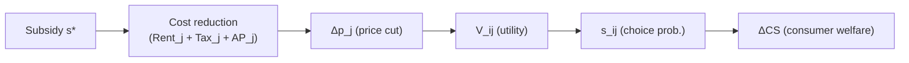
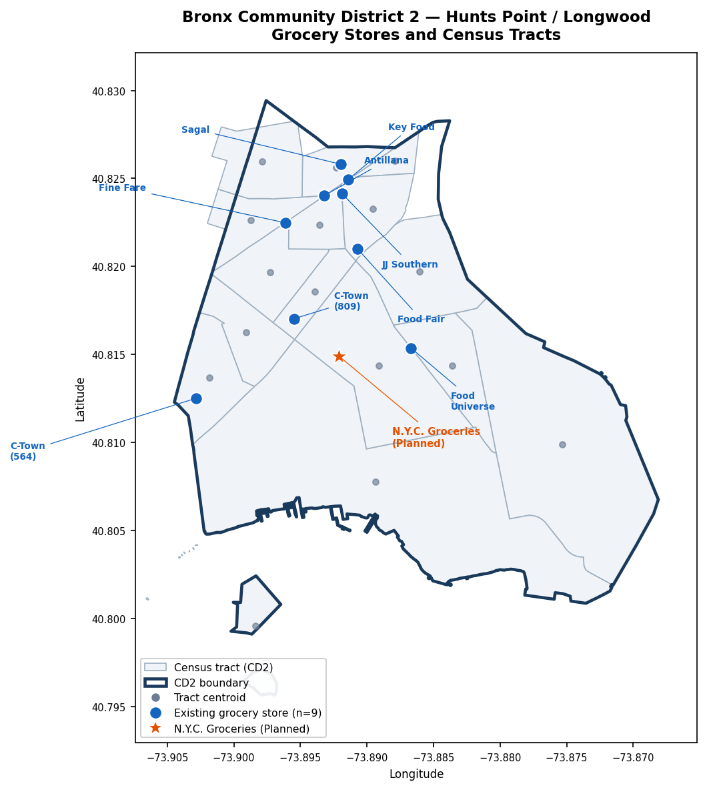

# NYC Grocery Subsidy Model Specification

**Study area:** Bronx Community District 2 (Hunts Point / Longwood), New York City  
**Policy context:** NYCEDC Request for Proposals — *NYC Groceries* initiative. The RFP solicits a city-operated or city-partnered full-service grocery store offering a 30% discount on a defined core basket of staple items, with NYCEDC covering rent, property taxes, and any remaining Affordability Payment required to deliver the discount.  
**Model vintage:** September 2026 · data vintage: 2024 ACS / Aug 2026 CPI-adjusted prices

---

## Causal Chain

---

## Part 1 — Model Equations

### 1.1 Consumer Demand

#### 1.1.1 Utility

$$V_{ij} = \beta_{\text{sqft}} \cdot \text{sqft}_j \;-\; \beta_{p,i} \cdot p_j \;-\; \beta_{d,i} \cdot d_{tj}$$

| Symbol | Type | Description | Value / Source |
|--------|------|-------------|----------------|
| $V_{ij}$ | output | Indirect utility for consumer group $i$ choosing store $j$ | derived |
| $\beta_{\text{sqft}}$ | param | Marginal utility of store floor area; common across groups | **design decision — no dataset** |
| $\text{sqft}_j$ | data | Store floor area (sq ft) | `data/stores/large_grocery_stores_cd2.csv` |
| $\beta_{p,i}$ | param | Price dis-utility per dollar; varies by income group $g$ | **design decision — no dataset** |
| $p_j$ | data | 10-item Crossa basket price, CPI-adjusted to Aug 2026 ($/basket) | `data/prices/p_j_cd2_candidate_stores.csv` |
| $\beta_{d,i}$ | param | Distance dis-utility per mile; varies by income group $g$ | **design decision — no dataset** |
| $d_{tj}$ | data | Straight-line distance (miles) from tract $t$ centroid to store $j$ | `data/distance/d_tract_store_miles.csv` |

---

#### 1.1.2 Consumer Groups

Index $i$ runs over 45 consumer groups: 15 non-zero-population census tracts $t$ × 3 income groups $g \in \{\text{Low, Mid, High}\}$.

$$i \;\equiv\; (t,\, g), \qquad n_i \equiv n_{t,g}$$

$$\sum_i n_i = N_{\text{HH}} = 19{,}922$$

Distance $d_{tj}$ is identical for all three income groups within tract $t$; it varies only across tracts.

| Symbol | Description | Value (2024) | Source |
|--------|-------------|--------------|--------|
| $t$ | Census tract index | 15 active tracts | `data/geography/bronx_cd2_tract_centroids.csv` |
| $g$ | Income group | Low ($<$\$25K$), Mid ($\$25$–$50K$), High ($>\$50K$) | — |
| $n_{t,g}$ | Households in tract $t$, group $g$ | — | `data/acs/cd2_B19001_2024.csv` |
| $N_{\text{HH}}$ | Total CD2 households | 19,922 (Low 7,683 · Mid 4,795 · High 7,444) | `data/acs/cd2_B19001_2024.csv` |

---

#### 1.1.3 Choice Probability

$$s_{ij} = \frac{\exp(V_{ij})}{\displaystyle\sum_{k=1}^{J} \exp(V_{ik})}$$

| Symbol | Description |
|--------|-------------|
| $s_{ij}$ | Probability that consumer group $i$ chooses store $j$ |
| $J$ | Number of stores in choice set (9 existing; 10 with planned NYC Groceries) |

---

#### 1.1.4 Aggregate Market Share

$$S_j = \frac{1}{N_{\text{HH}}} \sum_{i} n_i \cdot s_{ij}$$

| Symbol | Description |
|--------|-------------|
| $S_j$ | CD2-wide market share of store $j$ |

---

#### 1.1.5 Consumer Welfare (Annual Logsum)

$$W_i = \frac{T}{\beta_{p,i}} \ln\!\left[\sum_{k=1}^{J} \exp(V_{ik})\right]$$

$$\Delta CS = \sum_{i} \frac{n_i \cdot T}{\beta_{p,i}} \left[\ln\sum_{k} \exp\!\left(V_{ik}^{\text{post}}\right) \;-\; \ln\sum_{k} \exp\!\left(V_{ik}^{\text{pre}}\right)\right]$$

| Symbol | Description | Value | Source |
|--------|-------------|-------|--------|
| $T$ | Shopping trips per year | 52 | **design decision** |
| $W_i$ | Annual consumer welfare for group $i$ (in utils, scaled by $1/\beta_{p,i}$) | derived | — |
| $\Delta CS$ | Annual change in consumer surplus across all 45 groups ($) | derived | — |

> **Issue #4 fix:** v3 welfare was per trip; multiplying by $T = 52$ converts to annual.

---

### 1.2 Store Price and Volume

#### 1.2.1 Revenue and Basket Volume

$$Q_j = \frac{R_j}{p_j}$$

$$M = \sum_{g} N_{g} \cdot \bar{f}_g \cdot 52 \;\approx\; \$112.98\text{M/yr (2024)}$$

| Symbol | Description | Value | Source |
|--------|-------------|-------|--------|
| $Q_j$ | Annual basket-equivalent volume at store $j$ | derived | — |
| $R_j$ | Annual revenue ($) | see store table below | `data/revenue/revenue_j_cd2_candidate_stores.csv` (Option A, ReferenceUSA) or `data/revenue_census_estimate/revenue_j_census_cd2_candidate_stores.csv` (Option B, census-based $828.62/sqft/yr) — **design decision** |
| $p_j$ | Basket price ($/basket) | \$27.76–\$30.32 | `data/prices/p_j_cd2_candidate_stores.csv` |
| $\bar{f}_g$ | Average weekly food-at-home expenditure, income group $g$ (NYC-scaled, Northeast CES) | Low \$81.64 · Mid \$94.17 · High \$146.94 | `data/bls/ces_fbar_by_income_group_northeast_cd2weighted.csv` |
| $N_g$ | Total households in income group $g$ (all tracts) | Low 7,683 · Mid 4,795 · High 7,444 | `data/acs/cd2_B19001_2024.csv` |
| $M$ | Annual CD2 grocery market size | \$112.98M | `data/bls/cd2_market_size_M_northeast_cd2weighted.csv` |

**Store-level data table (2024 vintage):**

| Store | Address | sqft | $p_j$ ($/basket) | $R_j$ — ReferenceUSA | $R_j$ — Census-based | $\text{Tax}_j$ | $\text{Rent}_j$ |
|-------|---------|------|---------|------------|------------|--------|---------|
| Key Food | 1050 Westchester Ave | 15,000 | \$27.76 | \$8,032,000 | \$12,430,000 | \$105,311 | \$276,450 |
| Food Fair Fresh Market | 1065 E 163rd St | 13,000 | \$28.95 | \$8,032,000 | \$10,771,000 | \$409,408 | \$239,590 |
| Fine Fare Supermarket | 950 Westchester Ave | 10,000 | \$30.32 | \$618,000 | \$8,286,000 | \$15,711 | \$184,300 |
| C-Town Supermarket | 564 Southern Blvd | 8,000 | \$28.82 | \$2,884,000 | \$6,629,000 | \$24,691 | \$147,440 |
| Food Universe | 724 Hunts Pt Ave | 8,000 | \$29.93 | \$2,884,000 | \$6,629,000 | \$49,764 | \$153,200 |
| C Town Supermarket | 809 Southern Blvd | 7,500 | \$28.82 | \$3,090,000 | \$6,215,000 | \$47,269 | \$129,900 |
| JJ Southern Farm Fruit | 1046 Southern Blvd | 1,600 | \$28.95 | \$577,000 | \$1,326,000 | \$17,155 | \$69,008 |
| Antillana Fresh Meat Market | 1025 Westchester Ave | 3,000 | \$28.95 | \$824,000 | \$2,486,000 | \$12,036 | \$68,520 |
| Sagal Meat Market | 1091 Southern Blvd | 2,500 | \$28.95 | \$299,000 | \$2,072,000 | \$9,067 | \$66,800 |

> Census-based $R_j = \text{sqft}_j \times \$828.62$/sqft/yr (Bronx NAICS 4451 central estimate).  
> Tax and Rent sources: `data/tax/tax_j_cd2_candidate_stores.csv`, `data/rent/rent_j_cd2_candidate_stores.csv`.

---

### 1.3 Subsidy Pass-Through — Two Model Versions

#### 1.3.1 — v1: Lump-sum Subsidy, Variable Pass-Through

$$\Delta p_j = \theta \cdot \frac{s}{Q_j}$$

$$V_{ij}^{\text{post}} = V_{ij}^{\text{pre}} + \beta_{p,i} \cdot \Delta p_j$$

| Symbol | Description | Values |
|--------|-------------|--------|
| $s$ | Annual lump-sum subsidy instrument ($) | e.g. $s = \tau \cdot \text{Tax}_j$ (tax break) or $s = \sigma$ (direct rent subsidy) |
| $\theta$ | Pass-through rate: fraction of instrument that reduces shelf price | \{0.40, 0.65, 0.85\} — three sensitivity runs |
| $Q_j$ | Annual basket volume at store $j$ | from §1.2.1 |
| $\Delta p_j$ | Reduction in basket price | derived |

---

#### 1.3.2 — v2: NYC Groceries Contract (30% Core Basket Discount)

Core basket share $\kappa_g$ is applied per income group (base version; see sensitivity below).

**Price reduction entering the utility function:**

$$\Delta p_{j,g} = 0.30 \cdot \kappa_g \cdot p_j$$

$$V_{ij}^{\text{post}} = V_{ij}^{\text{pre}} + \beta_{p,i} \cdot 0.30 \cdot \kappa_g \cdot p_j$$

Each income group $g$ in tract $t$ experiences a different effective price cut because $\kappa_g$ varies by income.

**Revenue cost of the 30% discount:**

The store-level demand-weighted core basket share is:

$$\kappa_j = \frac{\displaystyle\sum_{i} s_{ij} \cdot n_i \cdot \kappa_g}{\displaystyle\sum_{i} s_{ij} \cdot n_i}$$

$$\text{Gross discount cost} = 0.30 \cdot \kappa_j \cdot R_j$$

**Affordability Payment and total subsidy cost:**

NYCEDC covers $\text{Rent}_j$ and $\text{Tax}_j$ directly (store does not pay these). If the gross discount cost exceeds rent plus tax relief, NYCEDC pays an additional Affordability Payment:

$$\text{AP}_j = \max\!\left(0,\; 0.30 \cdot \kappa_j \cdot R_j \;-\; \text{Rent}_j \;-\; \text{Tax}_j\right)$$

Total annual subsidy cost to NYCEDC:

$$s_j^* = \text{Rent}_j + \text{Tax}_j + \text{AP}_j = \max\!\left(\text{Rent}_j + \text{Tax}_j,\; 0.30 \cdot \kappa_j \cdot R_j\right)$$

| Symbol | Description | Value | Source |
|--------|-------------|-------|--------|
| $\kappa_g$ | Core basket share by income group | Low 0.6247 · Mid 0.6218 · High 0.6059 (base, 2024) | `data/bls/kappa_core_basket_share_northeast_cd2weighted.csv` |
| $\kappa_j$ | Demand-weighted store-level core basket share | derived from $s_{ij}$ | — |
| $\text{AP}_j$ | Affordability Payment: subsidy over and above rent+tax coverage ($) | derived | — |
| $s_j^*$ | Total annual NYCEDC cost per store ($) | derived | — |
| $\text{Rent}_j$ | Annual rent ($) | \$66,800–\$276,450 (central estimate) | `data/rent/rent_j_cd2_candidate_stores.csv` |
| $\text{Tax}_j$ | Annual property tax, store share ($) | \$9,067–\$409,408 | `data/tax/tax_j_cd2_candidate_stores.csv` |

**$\kappa$ sensitivity (base run primary; low/high as bounds):**

| Income group | $\kappa_{\text{low}}$ | $\kappa_{\text{base}}$ | $\kappa_{\text{high}}$ |
|---|---|---|---|
| Low ($<$\$25K$) | 0.4026 | 0.6247 | 0.8468 |
| Mid ($\$25$–$50K$) | 0.3957 | 0.6218 | 0.8480 |
| High ($>\$50K$) | 0.3681 | 0.6059 | 0.8437 |
| CD2 overall | 0.3838 | 0.6146 | 0.8455 |

The $\kappa$ version controls which grocery sub-categories count as "core basket":  
- **low**: only unambiguous staples (meat, dairy, produce, grains — RFP-clear items)  
- **base**: "partly in" categories (frozen foods, snacks, condiments) weighted 0.5  
- **high**: all "partly in" items at full weight

Sensitivity output table (populated when model runs):

| Store | $\text{AP}_j$ ($\kappa_{\text{low}}$) | $\text{AP}_j$ ($\kappa_{\text{base}}$) | $\text{AP}_j$ ($\kappa_{\text{high}}$) | $\Delta CS$ ($\kappa_{\text{low}}$) | $\Delta CS$ ($\kappa_{\text{base}}$) | $\Delta CS$ ($\kappa_{\text{high}}$) |
|-------|---|---|---|---|---|---|
| Key Food | — | — | — | — | — | — |
| Food Fair Fresh Market | — | — | — | — | — | — |
| Fine Fare Supermarket | — | — | — | — | — | — |
| C-Town (564) | — | — | — | — | — | — |
| Food Universe | — | — | — | — | — | — |
| C-Town (809) | — | — | — | — | — | — |
| JJ Southern Farm | — | — | — | — | — | — |
| Antillana | — | — | — | — | — | — |
| Sagal | — | — | — | — | — | — |

---

### 1.4 Welfare Update Steps

Applies identically to v1 and v2.

**Step A — Pre-subsidy utility (baseline):**

$$V_{ij}^{\text{pre}} = \beta_{\text{sqft}} \cdot \text{sqft}_j - \beta_{p,i} \cdot p_j - \beta_{d,i} \cdot d_{tj}$$

**Step B — Post-subsidy utility:**

$$V_{ij}^{\text{post}} = V_{ij}^{\text{pre}} + \beta_{p,i} \cdot \Delta p_{j,g}$$

where $\Delta p_{j,g}$ is from §1.3.1 (v1) or §1.3.2 (v2).

**Step C — Logsum welfare by group:**

$$L_i^{\text{pre}} = \ln\!\sum_{k=1}^{J}\exp\!\left(V_{ik}^{\text{pre}}\right), \qquad L_i^{\text{post}} = \ln\!\sum_{k=1}^{J}\exp\!\left(V_{ik}^{\text{post}}\right)$$

**Step D — Annual consumer surplus change:**

$$\Delta CS = \sum_{i=1}^{45} \frac{n_i \cdot T}{\beta_{p,i}} \left(L_i^{\text{post}} - L_i^{\text{pre}}\right)$$

---

### 1.5 Optimization and Store Ranking

**Store selection (9 existing stores):**

For v1, find $s_j^*$ such that $\Delta CS(s_j^*) \geq \Delta CS_{\min}$ via grid search over $s$. For v2, $\Delta p_{j,g}$ is fixed by contract; compute $\Delta CS$ directly and $s_j^*$ from §1.3.2.

Rank stores by welfare per dollar of subsidy:

$$\text{efficiency}_j = \frac{\Delta CS_j}{s_j^*}$$

**Store addition — NYC Groceries (static comparison):**

Add the planned store to the choice set with $J = 10$. Set $p_j^{\text{post}} = p_j \cdot (1 - 0.30 \cdot \kappa_g)$ per income group. Compute $\Delta CS$ relative to the 9-store baseline. $\text{Rent}_j$ and $\text{Tax}_j$ are covered by NYCEDC and included in $s_j^*$.

---

## Part 2 — NYC Groceries Store Inputs

| Input | Value | Source / Method |
|-------|-------|-----------------|
| Store name | N.Y.C. Groceries | RFP |
| Address | 1215 Spofford Ave, Bronx, NY 10474 | RFP Appendix D |
| Coordinates | lat 40.8149, lon −73.8921 | RFP Appendix D |
| $\text{sqft}_j$ | 15,000 | RFP Appendix D |
| $p_j$ | \$28.95/basket | All-Bronx CPI-adjusted average (no chain match); `data/prices/p_j_cd2_candidate_stores.csv` method |
| $p_j^{\text{post}}$ | $p_j \cdot (1 - 0.30 \cdot \kappa_g)$ per income group | Derived; base: Low ≈ \$22.52 · Mid ≈ \$22.57 · High ≈ \$22.68 |
| $R_j$ (census-based) | \$12,429,300 (= 15,000 × \$828.62) | `data/revenue_census_estimate/bronx_sales_per_sqft_census.csv` central estimate |
| $R_j$ (ReferenceUSA alt.) | \$15,280,000 (size-based, 15,000 sqft × median ReferenceUSA rate) | `data/revenue/revenue_j_cd2_candidate_stores.csv` — **design decision** |
| $\text{Rent}_j$ | \$276,450 (= 15,000 × \$18.43/sqft) | Median rent/sqft of 6 large (≥5,000 sqft) CD2 stores; `data/rent/rent_j_cd2_candidate_stores.csv` |
| $\text{Tax}_j$ | \$93,900 (= 15,000 × \$6.26/sqft, est.) | Median tax/sqft of 6 large CD2 stores (excl. Food Fair outlier); `data/tax/tax_j_cd2_candidate_stores.csv` |
| $\text{snap\_eligible}$ | 1 | SNAP authorization on opening per RFP policy goals |
| Store status | Planned (opening 2027) | RFP |

> **Note on Rent and Tax:** NYCEDC covers both per the RFP. They are nonetheless modeled as explicit line items in $s_j^*$ to show the full public cost and to compute $\text{AP}_j$.

---

## Part 3 — Map Figure

*Figure 1. Bronx CD2 (Hunts Point / Longwood): census tract boundaries and centroids, 9 existing large grocery stores (blue circles), and the planned N.Y.C. Groceries location at 1215 Spofford Ave (orange star).*

---

## Appendix — Parameter and Dataset Reference

### A.1 Full Symbol Table

| Symbol | First used | Type | Dataset path | Decision needed? |
|--------|-----------|------|-------------|-----------------|
| $V_{ij}$ | §1.1.1 | Derived | — | No |
| $\beta_{\text{sqft}}$ | §1.1.1 | Parameter | **no dataset** | **YES — must set before running** |
| $\text{sqft}_j$ | §1.1.1 | Data | `data/stores/large_grocery_stores_cd2.csv` | No |
| $\beta_{p,i}$ | §1.1.1 | Parameter | **no dataset** | **YES — must set before running** |
| $p_j$ | §1.1.1 | Data | `data/prices/p_j_cd2_candidate_stores.csv` | No |
| $\beta_{d,i}$ | §1.1.1 | Parameter | **no dataset** | **YES — must set before running** |
| $d_{tj}$ | §1.1.1 | Data | `data/distance/d_tract_store_miles.csv` | No — already built for 16 tracts × 10 stores |
| $n_{t,g}$ | §1.1.2 | Data | `data/acs/cd2_B19001_2024.csv` | No |
| $N_{\text{HH}}$ | §1.1.2 | Data | `data/acs/cd2_B19001_2024.csv` | No — 19,922 (2024) |
| $s_{ij}$ | §1.1.3 | Derived | — | No |
| $J$ | §1.1.3 | Data | — | No — 9 existing; 10 with NYC Groceries |
| $S_j$ | §1.1.4 | Derived | — | No |
| $T$ | §1.1.5 | Parameter | — | **YES — use 52 or income-differentiated?** (recommend 52) |
| $\Delta CS$ | §1.1.5 | Derived | — | No |
| $R_j$ | §1.2.1 | Data | Option A: `data/revenue/revenue_j_cd2_candidate_stores.csv` (`revenue_rusa_2024`) · Option B: `data/revenue_census_estimate/revenue_j_census_cd2_candidate_stores.csv` (`revenue_census_central`) | **YES — choose Option A or B** |
| $Q_j$ | §1.2.1 | Derived | — | No |
| $M$ | §1.2.1 | Data | `data/bls/cd2_market_size_M_northeast_cd2weighted.csv` | No — \$112.98M (2024) |
| $\bar{f}_g$ | §1.2.1 | Data | `data/bls/ces_fbar_by_income_group_northeast_cd2weighted.csv` | No |
| $\theta$ | §1.3.1 | Parameter | — | No — \{0.40, 0.65, 0.85\} for v1 sensitivity |
| $s$ | §1.3.1 | Instrument | — | v1 scenario input |
| $\kappa_g$ | §1.3.2 | Data | `data/bls/kappa_core_basket_share_northeast_cd2weighted.csv` | **YES — κ version: primary = base; low/high as sensitivity** |
| $\kappa_j$ | §1.3.2 | Derived | — | No |
| $\text{AP}_j$ | §1.3.2 | Derived | — | No |
| $s_j^*$ | §1.3.2 | Derived | — | No |
| $\text{Rent}_j$ | §1.3.2 | Data | `data/rent/rent_j_cd2_candidate_stores.csv` (`Rent_j`) | **YES — central vs. Rent\_j\_low / Rent\_j\_high?** |
| $\text{Tax}_j$ | §1.3.2 | Data | `data/tax/tax_j_cd2_candidate_stores.csv` (`Tax_j`) | No |

---

### A.2 Design Decision Flags

Decisions required before the model can produce numerical output:

| # | Symbol(s) | Decision | Status |
|---|-----------|----------|--------|
| 1 | $\beta_{\text{sqft}},\, \beta_{p,i},\, \beta_{d,i}$ | Set parameter values (no dataset exists; must come from literature calibration or assumption) | **OPEN** |
| 2 | $R_j$ | Choose revenue source: Option A (ReferenceUSA `revenue_rusa_2024`) or Option B (census-based `revenue_census_central`) | **OPEN** |
| 3 | $\text{Rent}_j$ bound | Use central `Rent_j`, `Rent_j_low`, or `Rent_j_high` | **OPEN** |
| 4 | $\kappa$ version | Primary run = **κ\_base**; κ\_low and κ\_high reported as sensitivity bounds | Resolved |
| 5 | $\kappa_g$ per income group vs. single κ | Use **per income group** $\kappa_g$ | Resolved |
| 6 | $d_{tj}$ file | Use `data/distance/d_tract_store_miles.csv` (already built, 15 active tracts × 10 stores) | Resolved |
| 7 | $T$ trips/year | Use **52** (weekly shopping) | Pending confirmation |
| 8 | $\theta$ scenarios (v1) | \{0.40, 0.65, 0.85\} | Pending confirmation |
| 9 | $J$ for baseline | 9 existing stores | Resolved |

---

### A.3 Data File Index

| File | Description |
|------|-------------|
| `data/stores/large_grocery_stores_cd2.csv` | 9 candidate stores: name, address, sqft, lat/lon, SNAP eligibility |
| `data/prices/p_j_cd2_candidate_stores.csv` | Basket price $p_j$ ($/10-item basket), CPI-adjusted to Aug 2026 |
| `data/revenue/revenue_j_cd2_candidate_stores.csv` | ReferenceUSA 2024 revenue; size-based fallback |
| `data/revenue_census_estimate/revenue_j_census_cd2_candidate_stores.csv` | Census-based revenue; `revenue_census_central` column |
| `data/revenue_census_estimate/bronx_sales_per_sqft_census.csv` | Bronx NAICS 4451 sales/sqft variants; central = \$828.62/sqft/yr |
| `data/tax/tax_j_cd2_candidate_stores.csv` | DOF property tax FY2025, store share (`Tax_j`) |
| `data/rent/rent_j_cd2_candidate_stores.csv` | DOF notice rent estimates (`Rent_j`, `Rent_j_low`, `Rent_j_high`) |
| `data/bls/ces_fbar_by_income_group_northeast_cd2weighted.csv` | Weekly food-at-home $\bar{f}_g$ by income group, Northeast CES, CD2-weighted |
| `data/bls/cd2_market_size_M_northeast_cd2weighted.csv` | Annual CD2 grocery market size $M$ |
| `data/bls/kappa_core_basket_share_northeast_cd2weighted.csv` | Core basket share $\kappa_g$ (low/base/high) by income group and ACS year |
| `data/bls/fbar_core_noncore_by_income_group_northeast.csv` | $\bar{f}_g$ split into core / non-core components |
| `data/distance/d_tract_store_miles.csv` | Tract-to-store distances (miles); 16 tracts × 10 stores |
| `data/geography/bronx_cd2_tract_centroids.csv` | Tract centroid coordinates (lat/lon) for 16 CD2 tracts |
| `data/geography/bronx_cd2_tracts.geojson` | Tract polygon boundaries |
| `data/geography/bronx_cd2_boundary.geojson` | CD2 district boundary polygon |
| `data/acs/cd2_B19001_2024.csv` | ACS B19001 household counts by tract and income bracket |
| `figures/cd2_store_map.png` | Map figure (generated by `code/generate_cd2_store_map.py`) |
