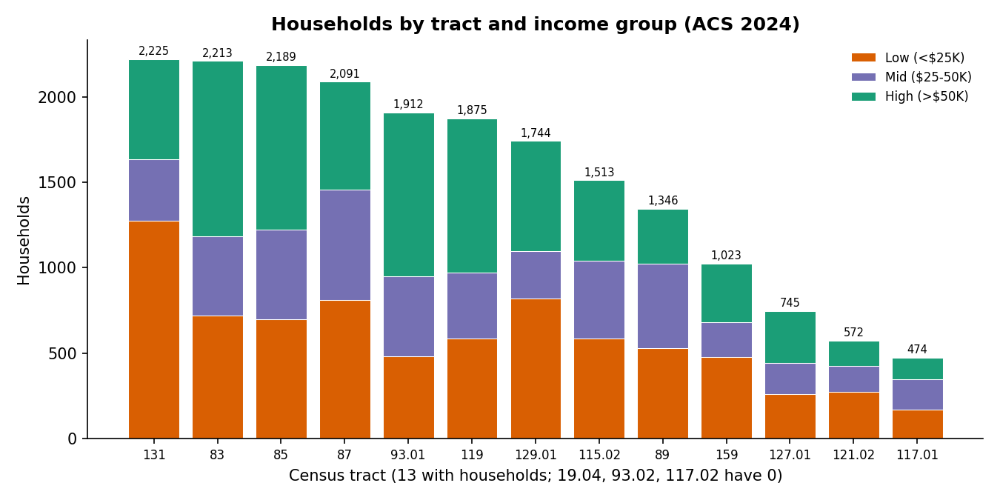
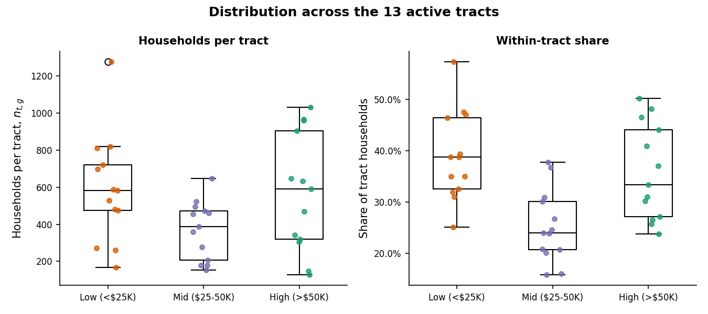
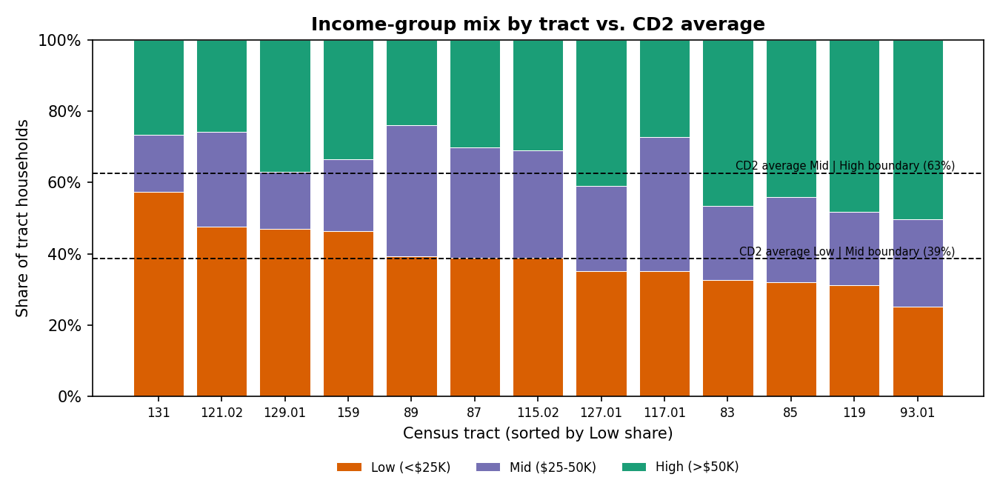
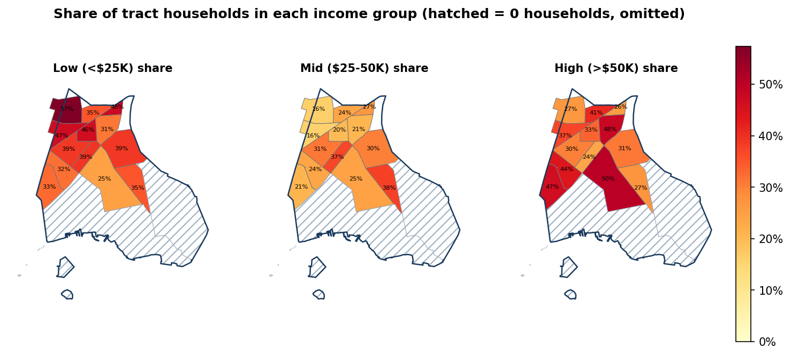
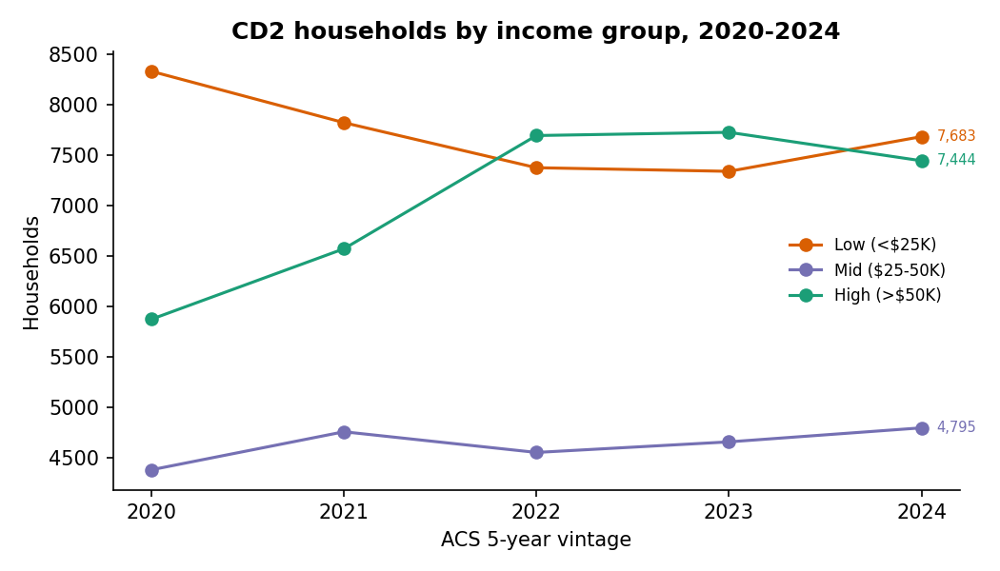
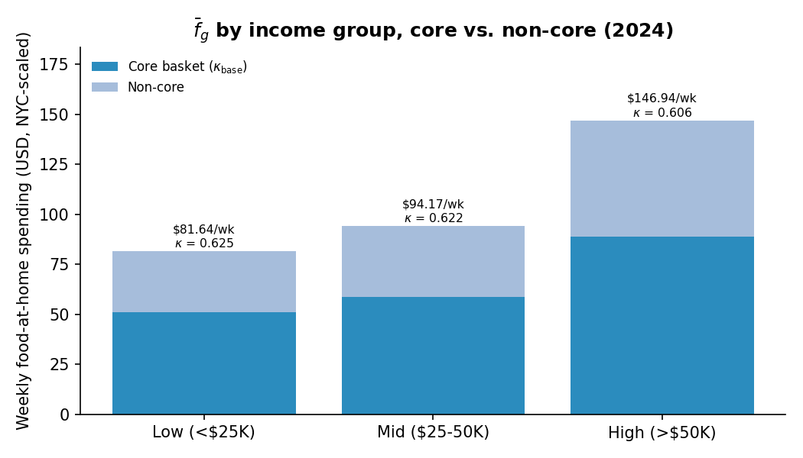
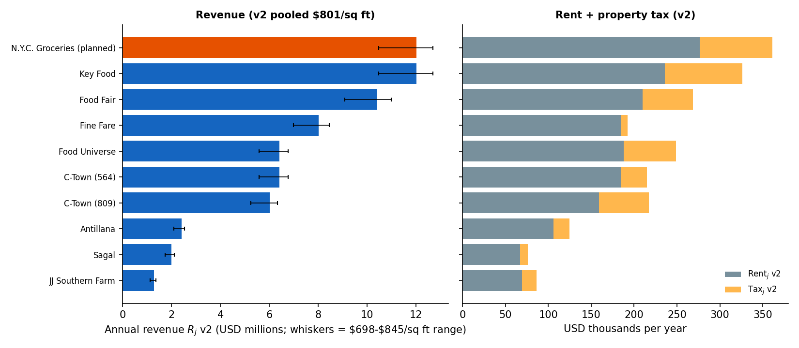
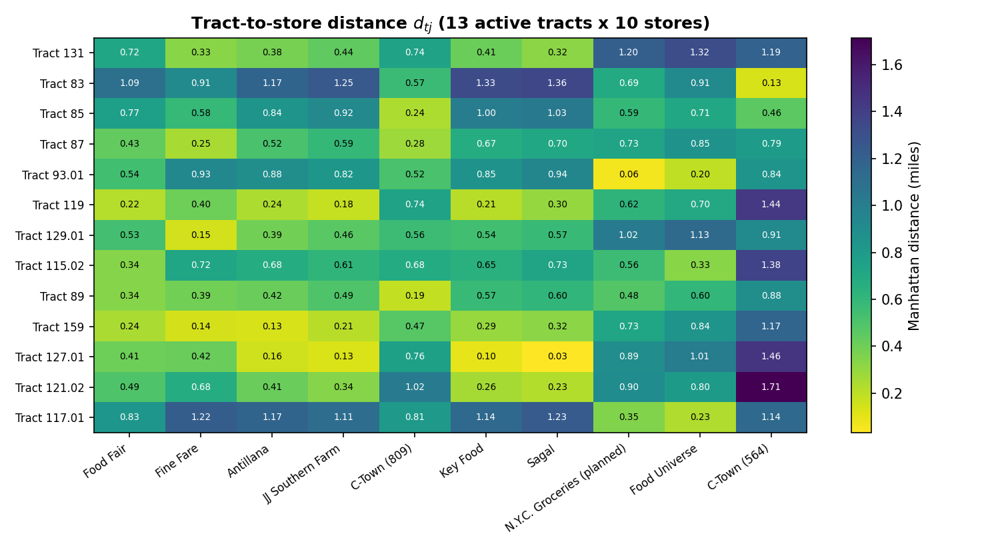

# Bronx CD2: Descriptive Statistics, v2

Companion to [`MAIN_NYC_Grocery_Subsidy_Model_Specification_v2.md`](archive/MAIN_NYC_Grocery_Subsidy_Model_Specification_v2.md) · Last updated: 2026-09-30

This report answers one question: **are the Low / Mid / High income groups balanced across CD2's census tracts?** It also collects in one place the other summary numbers the model uses: food spending $\bar f_g$, every $\kappa$ version, market size $M$, CD2 characteristics, store inputs and distances.

## Summary

- **The groups are not equal in size.** CD2 has 7,683 Low (38.6%), 4,795 Mid (24.1%) and 7,444 High (37.4%) households. Low is 1.6× the size of Mid.
- **They are spread fairly evenly across tracts.** Cramér's V for the tract × group table is 0.17, which counts as a small association. The dissimilarity indices are 0.16–0.20: only 16–20% of one group would have to move to another tract to match the other group's spread.
- **Consequence for the model:** tract-level distances end up similar across groups (household-weighted $d_{ij}$ differs by less than 0.12 mi for every store). Differences in store choice between groups will come mainly from $\beta_{p,i}$ and $\beta_{d,i}$, not from where the groups live.
- **Group size is not a problem for the model**, because every sum is weighted by $n_i$. It only matters when reading unweighted averages across groups.
- **Small cells:** 6 of the 39 consumer groups have fewer than 200 households. The smallest is 129 (High in tract 117.01). ACS margins of error on cells this small are wide.
- **Other figures:**
  - CD2 food-at-home spending is $M$ = \$112.98M a year.
  - About 61% of it is core-basket spending ($\kappa_{\text{base}}$).
  - At the v2 revenue rate, the 9 stores capture \$54.96M (49% of $M$).
  - Rent + Tax v2 is 2.4–6.7% of each store's revenue.

## Files

- Code: [`code/build_cd2_descriptive_stats_v2.py`](../code/build_cd2_descriptive_stats_v2.py). Run `python code/build_cd2_descriptive_stats_v2.py`; it takes a few minutes, mostly importing geopandas.
- Output data: `data/descriptive_stats_v2/` (all new)
- Output figures: `figures/descriptive_v2/` (all new)

| File (new) | Contents |
|---|---|
| `hh_by_tract_income_group_v2.csv` | $n_{t,g}$, within-tract shares, largest group, NTA, land area and household density for all 16 tracts; `active_tract` flags the 3 zero-household tracts |
| `income_group_summary_stats_v2.csv` | For each group across the 13 active tracts: total, CD2 share, mean, SD, min, p25, median, p75, max, CV; within-tract share mean / SD / min / max; number of tracts where the group is largest |
| `income_group_balance_v2.csv` | Balance tests: goodness of fit to equal thirds, chi-square test of independence, Cramér's V, dissimilarity indices, smallest and largest cells |
| `hh_by_income_group_trend_v2.csv` | Households and shares by group, ACS 2020–2024 |
| `fbar_kappa_summary_2024_v2.csv` | 2024 $\bar f_g$ (weekly, annual), $\kappa_g$ (low / base / high), core / non-core split at $\kappa_{\text{base}}$, $M_g$ |
| `store_summary_stats_v2.csv` | 9 stores + N.Y.C. Groceries: sq ft, SNAP type, $p_j$, $R_j$ v2 (low / high), $Q_j$, share of $M$, Rent and Tax v2, per-sq-ft rates, (Rent + Tax) / $R_j$; summary rows (total, mean, median, min, max) |
| `distance_summary_by_store_v2.csv` | For each store: min / mean / max Manhattan distance over the active tracts, the household-weighted mean, $d_{ij}$ by group, and the tracts and households for which it is the nearest store |
| `cd2_characteristics_v2.csv` | Tract counts, land area, density, NTA split, store density, floor area per household, $M$, and distance to the nearest store |

Inputs (read only):
- ACS: `data/acs/cd2_B19001_2024.csv`, `data/acs/cd2_household_income_summary.csv`
- Geography: `data/geography/bronx_cd2_tracts.geojson`
- CES spending and $\kappa$: `data/bls/ces_fbar_by_income_group_northeast_cd2weighted.csv`, `data/bls/fbar_core_noncore_by_income_group_northeast.csv`, `data/bls/kappa_core_basket_share_northeast_cd2weighted.csv`, `data/bls/kappa_core_basket_share.csv`, `data/bls/cd2_market_size_M_northeast_cd2weighted.csv`
- Store inputs: `data/prices/p_j_cd2_candidate_stores.csv`, `data/revenue_census_estimate/v2/*.csv`, `data/rent/v2/rent_j_cd2_candidate_stores_v2.csv`, `data/tax/v2/tax_j_cd2_candidate_stores_v2.csv`
- Distances: `data/distance/d_tract_store_miles.csv`, `data/distance/d_ij_cd2.csv`

Income groups follow ACS table B19001 (household income in the past 12 months): Low = under \$25K (brackets 002–005), Mid = \$25K–\$50K (006–010), High = \$50K and over (011–017).

---

## 1. Households by tract and income group

### 1.1 Table of $n_{t,g}$ (ACS 2024)

| Tract | NTA | Low | Mid | High | Total | Low % | Mid % | High % | Largest | HH per sq mi |
|---|---|---|---|---|---|---|---|---|---|---|
| 131 | Longwood | 1,277 | 358 | 590 | 2,225 | 57.4% | 16.1% | 26.5% | Low | 25,041 |
| 83 | Longwood | 721 | 462 | 1,030 | 2,213 | 32.6% | 20.9% | 46.5% | High | 26,622 |
| 85 | Longwood | 699 | 524 | 966 | 2,189 | 31.9% | 23.9% | 44.1% | High | 31,039 |
| 87 | Longwood | 812 | 647 | 632 | 2,091 | 38.8% | 30.9% | 30.2% | Low | 25,315 |
| 93.01 | Hunts Point | 480 | 471 | 961 | 1,912 | 25.1% | 24.6% | 50.3% | High | 8,665 |
| 119 | Longwood | 583 | 388 | 904 | 1,875 | 31.1% | 20.7% | 48.2% | High | 28,962 |
| 129.01 | Longwood | 820 | 277 | 647 | 1,744 | 47.0% | 15.9% | 37.1% | Low | 28,895 |
| 115.02 | Hunts Point | 587 | 456 | 470 | 1,513 | 38.8% | 30.1% | 31.1% | Low | 11,317 |
| 89 | Hunts Point | 530 | 495 | 321 | 1,346 | 39.4% | 36.8% | 23.8% | Low | 31,896 |
| 159 | Longwood | 475 | 206 | 342 | 1,023 | 46.4% | 20.1% | 33.4% | Low | 25,665 |
| 127.01 | Longwood | 261 | 179 | 305 | 745 | 35.0% | 24.0% | 40.9% | High | 17,709 |
| 121.02 | Longwood | 272 | 153 | 147 | 572 | 47.6% | 26.7% | 25.7% | Low | 28,687 |
| 117.01 | Hunts Point | 166 | 179 | 129 | 474 | 35.0% | 37.8% | 27.2% | Mid | 5,495 |
| **CD2 (13 active)** | | **7,683** | **4,795** | **7,444** | **19,922** | **38.6%** | **24.1%** | **37.4%** | | **19,251** |
| 19.04 | N. & S. Brother Islands | 0 | 0 | 0 | 0 | – | – | – | omitted | 0 |
| 93.02 | Hunts Point | 0 | 0 | 0 | 0 | – | – | – | omitted | 0 |
| 117.02 | Hunts Point | 0 | 0 | 0 | 0 | – | – | – | omitted | 0 |

The three zero-household tracts are the Brother Islands, the Hunts Point food distribution center, and the eastern industrial and waterfront area. Together they are 1.17 of CD2's 2.20 sq mi. They are left out of the model's consumer groups (13 tracts × 3 = 39 groups).

### 1.2 Summary statistics across the 13 active tracts

| Group | Total HH | CD2 share | Mean per tract | SD | Min | P25 | Median | P75 | Max | CV | Tracts where largest |
|---|---|---|---|---|---|---|---|---|---|---|---|
| Low ($<$\$25K) | 7,683 | 38.6% | 591.0 | 291.7 | 166 | 475 | 583 | 721 | 1,277 | 0.49 | 7 |
| Mid (\$25–50K) | 4,795 | 24.1% | 368.8 | 157.6 | 153 | 206 | 388 | 471 | 647 | 0.43 | 1 |
| High ($>$\$50K) | 7,444 | 37.4% | 572.6 | 317.6 | 129 | 321 | 590 | 904 | 1,030 | 0.55 | 5 |
| All households | 19,922 | 100% | 1,532.5 | 642.2 | 474 | 1,023 | 1,744 | 2,091 | 2,225 | 0.42 | – |

Within-tract shares (the share of each tract's households in the group):

| Group | Mean | SD | Min | Max |
|---|---|---|---|---|
| Low | 38.9% | 8.7 pp | 25.1% (93.01) | 57.4% (131) |
| Mid | 25.3% | 7.0 pp | 15.9% (129.01) | 37.8% (117.01) |
| High | 35.8% | 9.3 pp | 23.8% (89) | 50.3% (93.01) |

### 1.3 Are the groups balanced?

| Check | Result | Reading |
|---|---|---|
| Group sizes | Low 7,683 · Mid 4,795 · High 7,444 | Mid is the smallest group |
| Largest ÷ smallest group | 1.60 (Low ÷ Mid) | |
| Goodness of fit to equal thirds | χ² = 773.8, df = 2, p ≈ 10⁻¹⁶⁸ | **Group sizes are not equal** |
| Independence, tract × group | χ² = 1,199.7, df = 24, p ≈ 10⁻²³⁸ | The mix differs across tracts. With about 20,000 households, even small differences are significant, so look at the effect size |
| Cramér's V | **0.174** | **Small association** (under 0.1 is negligible; 0.1–0.3 is small) |
| Dissimilarity, Low vs Mid | 0.163 | 16% of Low households would have to move tracts to match Mid's distribution |
| Dissimilarity, Low vs High | 0.202 | The most separated pair |
| Dissimilarity, Mid vs High | 0.174 | |
| Smallest cell $n_{t,g}$ | 129 (High, tract 117.01) | |
| Largest cell | 1,277 (Low, tract 131) | |
| Cells under 200 households | 6 of 39 | 117.01 (all three groups), 121.02 (Mid, High), 127.01 (Mid) |

**Verdict.**
- **Not balanced in size.** Mid is about 24% of households, against 37–39% for Low and High.
- **Reasonably balanced in space.** Every group makes up at least 15.9% of every active tract's households. No tract is dominated by one group: the largest share is Low at 57% in tract 131.
- **Where the groups tilt:**
  - Longwood's northwest tracts (131, 129.01, 159, 121.02) lean Low.
  - Tracts 83, 85, 119 and 93.01 lean High.
  - Tracts 87, 89, 115.02 and 117.01 are the most evenly mixed.
- **For the model:**
  - Weights $n_{t,g}$ handle the size imbalance automatically.
  - The 6 small cells carry little weight in $\Delta CS$ (together 953 households, 4.8% of CD2).
  - ACS margins of error were not downloaded. Counts under about 200 households usually carry wide ACS 5-year margins, so tract-level shares for 117.01, 121.02 and 127.01 should be read loosely.

### 1.4 Trend, ACS 2020–2024

| ACS 5-year vintage | Households | Low | Mid | High | Low % | Mid % | High % |
|---|---|---|---|---|---|---|---|
| 2020 | 18,582 | 8,331 | 4,379 | 5,872 | 44.8% | 23.6% | 31.6% |
| 2021 | 19,149 | 7,822 | 4,756 | 6,571 | 40.8% | 24.8% | 34.3% |
| 2022 | 19,620 | 7,375 | 4,551 | 7,694 | 37.6% | 23.2% | 39.2% |
| 2023 | 19,721 | 7,339 | 4,656 | 7,726 | 37.2% | 23.6% | 39.2% |
| 2024 | 19,922 | 7,683 | 4,795 | 7,444 | 38.6% | 24.1% | 37.4% |

The Low share fell 6 points and the High share rose 6 points from 2020 to 2024. Some of that is nominal: the \$25K / \$50K cut-offs are not inflation-adjusted, so rising nominal incomes move households up a group. The Mid share has stayed at 23–25%.

---

## 2. Food spending ($\bar f_g$) and market size ($M$)

Source: BLS Consumer Expenditure Survey, Northeast region by income, 2023–2024, weighted to CD2's B19001 bracket mix and scaled to the New York metro (scale factor 1.0006). See [`docs/fbar_M_update_log.md`](fbar_M_update_log.md) and [`docs/core_basket_fbar.md`](core_basket_fbar.md).

### 2.1 2024 values

| Group | Households | $\bar f_g$ weekly | $\bar f_g$ annual | $M_g = N_g \bar f_g \times 52$ | Share of $M$ |
|---|---|---|---|---|---|
| Low | 7,683 | \$81.64 | \$4,245 | \$32.62M | 28.9% |
| Mid | 4,795 | \$94.17 | \$4,897 | \$23.48M | 20.8% |
| High | 7,444 | \$146.94 | \$7,641 | \$56.88M | 50.3% |
| **CD2** | **19,922** | **\$109.06** | **\$5,671** | **\$112.98M** | 100% |

High-income households are 37% of households but half of grocery spending.

### 2.2 $\bar f_g$ by ACS vintage (weekly, NYC-scaled; CES 2023–2024 held fixed)

| Group | 2020 | 2021 | 2022 | 2023 | 2024 |
|---|---|---|---|---|---|
| Low | \$81.48 | \$81.56 | \$81.57 | \$81.53 | \$81.64 |
| Mid | \$91.66 | \$92.46 | \$92.84 | \$93.59 | \$94.17 |
| High | \$141.64 | \$142.98 | \$145.35 | \$146.52 | \$146.94 |
| CD2 overall | \$102.89 | \$105.34 | \$109.20 | \$109.84 | \$109.06 |
| **$M$ (annual)** | **\$99.42M** | **\$104.90M** | **\$111.41M** | **\$112.64M** | **\$112.98M** |

The year-to-year changes come only from CD2's shifting bracket mix, because the CES spending rates are the same 2023–2024 values in every column.

### 2.3 Core vs non-core split, 2024 (weekly, NYC-scaled)

| Group | $\kappa_{\text{low}}$: core / non-core | $\kappa_{\text{base}}$: core / non-core | $\kappa_{\text{high}}$: core / non-core |
|---|---|---|---|
| Low | \$32.87 / \$48.77 | \$51.00 / \$30.64 | \$69.13 / \$12.51 |
| Mid | \$37.26 / \$56.91 | \$58.56 / \$35.61 | \$79.85 / \$14.32 |
| High | \$54.08 / \$92.86 | \$89.03 / \$57.91 | \$123.98 / \$22.96 |
| CD2 overall | \$41.85 / \$67.20 | \$67.03 / \$42.03 | \$92.21 / \$16.85 |
| **CD2 core market $M_{\text{core}}$ (annual)** | **\$43.36M** | **\$69.44M** | **\$95.52M** |

---

## 3. Core basket share ($\kappa$), all versions

Source: `data/bls/kappa_core_basket_share_northeast_cd2weighted.csv` (the model input). See [`docs/kappa_core_basket.md`](kappa_core_basket.md) for how the low / base / high versions are defined:
- **low:** RFP-clear staples only
- **base:** "partly in" categories at weight 0.5
- **high:** "partly in" categories at full weight

### 3.1 Northeast, CD2-weighted, by ACS vintage (low / base / high)

| Group | 2020 | 2021 | 2022 | 2023 | 2024 |
|---|---|---|---|---|---|
| Low ($<$\$25K) | 0.4025 / 0.6245 / 0.8466 | 0.4025 / 0.6246 / 0.8467 | 0.4025 / 0.6246 / 0.8467 | 0.4025 / 0.6246 / 0.8466 | **0.4026 / 0.6247 / 0.8468** |
| Mid (\$25–50K) | 0.3949 / 0.6214 / 0.8480 | 0.3948 / 0.6214 / 0.8480 | 0.3948 / 0.6214 / 0.8480 | 0.3950 / 0.6215 / 0.8480 | **0.3957 / 0.6218 / 0.8480** |
| High ($>$\$50K) | 0.3702 / 0.6069 / 0.8436 | 0.3699 / 0.6068 / 0.8437 | 0.3685 / 0.6061 / 0.8438 | 0.3682 / 0.6060 / 0.8437 | **0.3681 / 0.6059 / 0.8437** |
| CD2 overall | 0.3869 / 0.6162 / 0.8456 | 0.3857 / 0.6156 / 0.8456 | 0.3832 / 0.6143 / 0.8454 | 0.3831 / 0.6142 / 0.8454 | **0.3838 / 0.6146 / 0.8455** |

Bold = 2024, used in the model.

### 3.2 Comparison: national, unweighted (`data/bls/kappa_core_basket_share.csv`, earlier version)

| Group | $\kappa_{\text{low}}$ | $\kappa_{\text{base}}$ | $\kappa_{\text{high}}$ |
|---|---|---|---|
| All | 0.370 | 0.602 | 0.833 |
| Low | 0.376 | 0.603 | 0.830 |
| Mid | 0.372 | 0.601 | 0.830 |
| High | 0.369 | 0.602 | 0.834 |

**Observations.**
- $\kappa$ barely varies by group: at $\kappa_{\text{base}}$ the range is 0.606–0.625, and it is almost constant across vintages.
- The choice of version (low / base / high, about ±0.23) matters far more than the income group (±0.01).
- With $\kappa_{\text{base}}$, the effective price cut $0.30\,\kappa_g$ is 18.7% (Low), 18.7% (Mid) and 18.2% (High).

---

## 4. CD2 characteristics

| Metric | Value |
|---|---|
| Census tracts (2020 geography) | 16 |
| Tracts with households (active) | 13 |
| Tracts with 0 households (omitted) | 3 (19.04, 93.02, 117.02) |
| Consumer groups $i = (t, g)$ | 39 |
| Households $N_{\text{HH}}$ (ACS 2024) | 19,922 |
| Land area, all 16 tracts / 13 active tracts | 2.20 sq mi / 1.03 sq mi |
| Household density, active tracts (overall / median tract) | 19,251 / 25,665 per sq mi |
| Households in Longwood (9 active tracts) / Hunts Point (4 active tracts) | 14,677 (74%) / 5,245 (26%) |
| Existing large grocery stores | 9 (+1 planned) |
| Stores per 10,000 households | 4.5 |
| Grocery floor area, 9 stores (Ag & Markets) | 68,600 sq ft (3.4 sq ft per household) |
| Annual grocery market $M$ | \$112.98M (\$5,671 per household) |
| 9-store revenue, v2 | \$54.96M (48.6% of $M$) |
| Median basket price $p_j$ | \$28.95 |
| Household-weighted distance to the nearest existing store | 0.210 mi (Manhattan) |
| ... including N.Y.C. Groceries | 0.197 mi |

---

## 5. Store statistics

Sources:
- Revenue: [`revenue_census_estimate_v2.md`](revenue_census_estimate_v2.md)
- Rent and tax: [`rent_and_tax_fy2025_v2.md`](rent_and_tax_fy2025_v2.md)
- Prices: `data/prices/p_j_cd2_candidate_stores.csv`

N.Y.C. Groceries values are derived as follows:
- $R_j$: 15,000 sq ft × \$801.18
- Rent: 15,000 × \$18.43
- Tax: 15,000 × \$5.67, the median v2 tax per occupied sq ft of the 6 large stores

| Store | SNAP type | sq ft (Ag & M) | Occupied sq ft | $p_j$ | $R_j$ v2 | $Q_j$ | Share of $M$ | $\text{Rent}_j$ | Rent / sq ft | $\text{Tax}_j$ | Tax / occ. sq ft | Rent + Tax | (Rent + Tax) / $R_j$ |
|---|---|---|---|---|---|---|---|---|---|---|---|---|---|
| Key Food | Super Store | 15,000 | 12,810 | \$27.76 | \$12.02M | 432,925 | 10.6% | \$236,088 | \$18.43 | \$89,902 | \$7.02 | \$325,990 | 2.7% |
| Food Fair | Super Store | 13,000 | 11,400 | \$28.95 | \$10.42M | 359,758 | 9.2% | \$210,102 | \$18.43 | \$58,408 | \$5.12 | \$268,510 | 2.6% |
| Fine Fare | Supermarket | 10,000 | 10,000 | \$30.32 | \$8.01M | 264,248 | 7.1% | \$184,300 | \$18.43 | \$8,140 | \$0.81 | \$192,440 | 2.4% |
| Food Universe | Supermarket | 8,000 | 9,800 | \$29.93 | \$6.41M | 214,133 | 5.7% | \$187,670 | \$19.15 | \$60,962 | \$6.22 | \$248,632 | 3.9% |
| C-Town (564) | Super Store | 8,000 | 10,000 | \$28.82 | \$6.41M | 222,380 | 5.7% | \$184,300 | \$18.43 | \$30,864 | \$3.09 | \$215,164 | 3.4% |
| C-Town (809) | Supermarket | 7,500 | 9,200 | \$28.82 | \$6.01M | 208,501 | 5.3% | \$159,344 | \$17.32 | \$57,991 | \$6.30 | \$217,335 | 3.6% |
| Antillana | Large Grocery | 3,000 | 4,635 | \$28.95 | \$2.40M | 83,040 | 2.1% | \$105,863 | \$22.84 | \$18,597 | \$4.01 | \$124,460 | 5.2% |
| Sagal | Large Grocery | 2,500 | 2,500 | \$28.95 | \$2.00M | 69,188 | 1.8% | \$66,800 | \$26.72 | \$9,067 | \$3.63 | \$75,867 | 3.8% |
| JJ Southern Farm | Supermarket | 1,600 | 1,600 | \$28.95 | \$1.28M | 44,283 | 1.1% | \$69,008 | \$43.13 | \$17,155 | \$10.72 | \$86,163 | 6.7% |
| *N.Y.C. Groceries (planned)* | – | *15,000* | *15,000* | *\$28.95* | *\$12.02M* | *415,130* | *10.6%* | *\$276,450* | *\$18.43* | *\$85,081* | *\$5.67* | *\$361,531* | *3.0%* |
| **Total (9 existing)** | | **68,600** | **71,945** | | **\$54.96M** | **1,898,456** | **48.6%** | **\$1,403,475** | | **\$351,085** | | **\$1,754,560** | **3.2%** |
| Mean (9) | | 7,622 | 7,994 | \$29.05 | \$6.11M | 210,940 | 5.4% | \$155,942 | \$22.54 | \$39,009 | \$5.21 | \$194,951 | 3.8% |
| Median (9) | | 8,000 | 9,800 | \$28.95 | \$6.41M | 214,133 | 5.7% | \$184,300 | \$18.43 | \$30,864 | \$5.12 | \$215,164 | 3.6% |
| Min (9) | | 1,600 | 1,600 | \$27.76 | \$1.28M | 44,283 | 1.1% | \$66,800 | \$17.32 | \$8,140 | \$0.81 | \$75,867 | 2.4% |
| Max (9) | | 15,000 | 12,810 | \$30.32 | \$12.02M | 432,925 | 10.6% | \$236,088 | \$43.13 | \$89,902 | \$10.72 | \$325,990 | 6.7% |

Sensitivity ranges (9-store totals):
- $R_j$: \$47.88M – \$57.97M
- Rent: \$1.29M – \$1.59M
- Tax: up to \$651,715, if Food Fair's tax is split by floor area

**Observations.**
- Revenue is proportional to Ag & Markets sq ft, because v2 applies one rate to all stores. The top three (Key Food, Food Fair, Fine Fare) account for 55% of 9-store revenue.
- Basket prices are tight: \$27.76–\$30.32, a spread of 9%.
- Rent + Tax is small next to revenue: 2.4–6.7%, and 3.2% overall. The 30% core-basket discount costs about 18% of revenue ($0.30 \times \kappa$). Under the contract, the Affordability Payment, not rent and tax relief, would be the main public cost.

---

## 6. Distances ($d_{tj}$, Manhattan miles)

Computed over the 13 active tracts, from `data/distance/d_tract_store_miles.csv` and `data/distance/d_ij_cd2.csv`. "Nearest for" counts the tracts, and their households, for which the store is the closest one.

| Store | Min | Mean (unweighted) | Max | Mean (HH-weighted) | $d_{ij}$ Low | $d_{ij}$ Mid | $d_{ij}$ High | Nearest for (9 stores) | Nearest for (10 stores) |
|---|---|---|---|---|---|---|---|---|---|
| Fine Fare | 0.14 | 0.55 | 1.22 | 0.52 | 0.48 | 0.54 | 0.55 | 2 tracts / 3,835 HH | 2 / 3,835 |
| C-Town (809) | 0.19 | 0.58 | 1.02 | 0.54 | 0.55 | 0.51 | 0.54 | 2 / 3,535 | 2 / 3,535 |
| Food Fair | 0.22 | 0.53 | 1.09 | 0.56 | 0.56 | 0.54 | 0.58 | 0 | 0 |
| Antillana | 0.13 | 0.57 | 1.17 | 0.59 | 0.55 | 0.61 | 0.62 | 1 / 1,023 | 1 / 1,023 |
| JJ Southern Farm | 0.13 | 0.58 | 1.25 | 0.62 | 0.59 | 0.63 | 0.65 | 1 / 1,875 | 1 / 1,875 |
| Key Food | 0.10 | 0.62 | 1.33 | 0.66 | 0.63 | 0.68 | 0.69 | 0 | 0 |
| *N.Y.C. Groceries (planned)* | *0.06* | *0.68* | *1.20* | *0.69* | *0.75* | *0.64* | *0.65* | – | *1 / 1,912* |
| Sagal | 0.03 | 0.64 | 1.36 | 0.69 | 0.65 | 0.71 | 0.73 | 3 / 3,542 | 3 / 3,542 |
| Food Universe | 0.20 | 0.74 | 1.32 | 0.78 | 0.83 | 0.72 | 0.75 | 3 / 3,899 | 2 / 1,987 |
| C-Town (564) | 0.13 | 1.04 | 1.71 | 0.93 | 0.97 | 0.93 | 0.89 | 1 / 2,213 | 1 / 2,213 |

**Observations.**
- The 7 Westchester Ave / Southern Blvd stores sit within about 0.8 mi of each other in Longwood. Their household-weighted distances are all 0.52–0.69 mi.
- N.Y.C. Groceries would become the nearest store for tract 93.01 (1,912 households), taking it from Food Universe. It cuts the household-weighted distance to the nearest store from 0.210 to 0.197 mi.
- Group differences in $d_{ij}$ are at most 0.12 mi (Food Universe and N.Y.C. Groceries, which are closer to High and Mid households than to Low households). This matches the finding in section 1 that the groups live mixed together.

---

## Caveats

1. **ACS sampling error.** B19001 counts are 5-year survey estimates. Margins of error were not downloaded, and cells under about 200 households (6 of 39) are imprecise.
2. **Nominal income cut-offs.** The \$25K / \$50K cut-offs are not inflation-adjusted across vintages, so part of the 2020–2024 shift from Low to High is inflation.
3. **Land area** comes from the tract polygons (`shape_area`, in sq ft) and includes parks and industrial land. Household density is therefore a gross figure.
4. **Store statistics** inherit the caveats in the v2 revenue and rent/tax docs:
   - one revenue rate for all store formats;
   - Food Fair's tax income split is a modeling choice;
   - Fine Fare's 421-a exemption may end;
   - leases may be gross or net.
5. **N.Y.C. Groceries** inputs are estimates for a store that isn't open yet. Its site is city-owned and may be tax-exempt.
